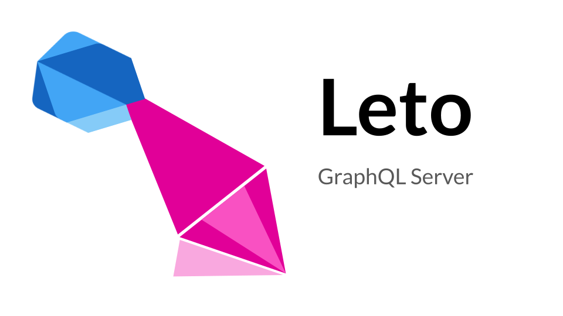

<div style="text-align: center">
<hr>
<a href="https://pub.dartlang.org/packages/leto" rel="nofollow">
  
</a>
<a href="https://codecov.io/gh/juancastillo0/leto">
  
</a>
<a href="https://github.com/juancastillo0/leto/actions/workflows/test.yaml">
  
</a>
<a href="https://github.com/juancastillo0/leto/actions/workflows/test.yaml">
  
</a>

</div>

# Leto - GraphQL Server <!-- omit in toc -->

A complete implementation of the official
[GraphQL specification](https://graphql.github.io/graphql-spec/June2018/)
in the Dart programming language.

Inspired by [graphql-js](https://github.com/graphql/graphql-js), [async-graphql](https://github.com/async-graphql/async-graphql) and [type-graphql](https://github.com/MichalLytek/type-graphql). First version of the codebase was forked from [angel-graphql](https://github.com/angel-dart-archive/graphql). Many tests and utilities ([DataLoader](https://github.com/graphql/dataloader), [printSchema](https://github.com/graphql/graphql-js/blob/10c1c3d6cd8e165501fb1471b5babfabd1be1eb1/src/utilities/printSchema.ts)) were ported from graphql-js.

## Table of Contents <!-- omit in toc -->
- [Quickstart](#quickstart)
    - [Install](#install)
    - [Create a `GraphQLSchema`](#create-a-graphqlschema)
    - [Start the server](#start-the-server)
    - [Test the server](#test-the-server)
- [Examples](#examples)
  - [Fullstack Dart Chat](#fullstack-dart-chat)
    - [Chat functionalities](#chat-functionalities)
  - [Server example](#server-example)
- [Packages](#packages)
- [Documentation](#documentation)
- [GraphQL Schema Types](#graphql-schema-types)
  - [Scalars](#scalars)
  - [Enums](#enums)
  - [Objects](#objects)
    - [Interfaces](#interfaces)
  - [Inputs and Input Objects](#inputs-and-input-objects)
    - [InputObject.fromJson](#inputobjectfromjson)
  - [Unions](#unions)
    - [Freezed Unions](#freezed-unions)
  - [Abstract Types](#abstract-types)
    - [resolveType](#resolvetype)
    - [Generics](#generics)
    - [isTypeOf](#istypeof)
    - [\_\_typename](#__typename)
    - [Serialize and validate](#serialize-and-validate)
  - [Advanced Types](#advanced-types)
    - [Provided Types](#provided-types)
    - [Cyclic Types](#cyclic-types)
    - [Custom Scalars](#custom-scalars)
    - [Generic Types](#generic-types)
- [Subscriptions](#subscriptions)
    - [Examples](#examples-1)
- [Miscellaneous](#miscellaneous)
  - [`ScopedMap`](#scopedmap)
  - [Error Handling](#error-handling)
  - [Input Validation](#input-validation)
  - [Query Complexity (Not implemented, yet)](#query-complexity-not-implemented-yet)
- [Web integrations](#web-integrations)
  - [Server integrations](#server-integrations)
    - [Shelf](#shelf)
  - [Web UI Explorers](#web-ui-explorers)
    - [GraphiQL](#graphiql)
    - [Playground](#playground)
    - [Altair](#altair)
  - [Clients](#clients)
- [Solving the N+1 problem](#solving-the-n1-problem)
  - [Lookahead](#lookahead)
  - [DataLoader](#dataloader)
- [Extensions](#extensions)
  - [Persisted Queries](#persisted-queries)
  - [Apollo Tracing](#apollo-tracing)
  - [Response Cache](#response-cache)
  - [Logging Extension](#logging-extension)
  - [Map Error Extension](#map-error-extension)
  - [Custom Extensions](#custom-extensions)
- [Directives](#directives)
- [Utilities](#utilities)
    - [`buildSchema`](#buildschema)
    - [`printSchema`](#printschema)
    - [`mergeSchema`](#mergeschema)
- [Contributing](#contributing)

# Quickstart

This provides a simple introduction to Leto, you can explore more in the following sections of this README or by looking at the tests, documentation and examples for each package. A fullstack Dart example with Flutter client and Leto/Shelf server can be found in https://github.com/juancastillo0/leto_graphql/chat_example

### Install

Add dependencies to your pubspec.yaml

```yaml
dependencies:
  leto: ^0.0.1
  leto_shelf: ^0.0.1
  shelf: ^1.0.0
  shelf_router: ^1.0.0
  # Not nessary for the server, just for testing it
  http: ^1.0.0

dev_dependencies:
  # Only if you use code generation
  leto_generator: ^0.0.1
```

### Create a `GraphQLSchema`

```dart

class Model {
    final String stringField;
    final int intField;
    final List<Model>? optionalNested;

    const Model({
        required this.stringField,
        required this.intField,
        required this.optionalNested,
    });
}


final modelGraphqlType = objectType<Model>(
    'Model',
    fields: [
       graphQLString.nonNull().field('stringField',resolve: (ReqCtx ctx, Model m)
        => m.intField,),
        field('intField', graphqlInt, resolve: (ReqCtx ctx, Model m)
        => m.intField,
        )
    ],
);

final apiSchema = GraphQLSchema(
    queryType: objectType(
        fields [
modelGraphqlType.field('getModel', resolve: (ReqCtx ctx, Object rootValue) => const Model(stringField: 'sField', ))
        ]
    )
)
```

Or with code generation

```dart
import 'package:leto_shelf/leto_shelf.dart';
part 'main.g.dart';

/// Get the current state
@Query()
String? getState(ReqCtx ctx) {
  return stateRef.get(ctx);
}

@Mutation()
bool setState(
  ReqCtx ctx,
  // The new state, can't be 'WrongState'!.
  String newState,
) {
  if (newState == 'WrongState') {
    return false;
  }
  stateRef.set(ctx, newState);
  return true;
}

```

which generates the same `modelGraphqlType` in `model.g.dart` and `apiSchema` in 'lib/graphql_api.schema.dart' (TODO: configurable).

### Start the server

### Test the server

/graphql-schema
/playground

# Examples

## Fullstack Dart Chat

A fullstack Dart example with Flutter client and Leto/Shelf server can be found in https://github.com/juancastillo0/leto_graphql/chat_example.

- Sqlite3 and Postgres database integrations
- Subscriptions
- Authentication/Authorization
- Sessions
- Tests
- File uploads
- Client/Server GraphQL extensions integration
- Docker

### Chat functionalities

- Send/receive/delete messages in realtime
  - File uploads
  - Link metadata
  - Reply to other messages
- Client cache through [Ferry](https://github.com/gql-dart/ferry) and [Hive](https://github.com/hivedb/hive)
- Create chat rooms, add/remove users and share authorized invite links
- View complete usage history with events for the most important mutations
- View all user sessions

## Server example

A fullstack Dart example with Flutter client and Leto/Shelf server can be found in https://github.com/juancastillo0/leto_graphql/chat_example

# Packages

| Pub                                                                  | Source                                                    | Description                                                             |
| -------------------------------------------------------------------- | --------------------------------------------------------- | ----------------------------------------------------------------------- |
| [![version][package:leto:version]][package:leto]                     | [`package:leto`][package:leto:source]                     | Base GraphQL server implementation                                      |
| [![version][package:leto_schema:version]][package:leto_schema]       | [`package:leto_schema`][package:leto_schema:source]       | Define GraphQL executable schemas                                       |
| [![version][package:leto_generator:version]][package:leto_generator] | [`package:leto_generator`][package:leto_generator:source] | Generate GraphQLSchemas and GraphQLTypes from Dart annotations          |
| [![version][package:leto_shelf:version]][package:leto_shelf]         | [`package:leto_shelf`][package:leto_shelf:source]         | GraphQL web server implementation using shelf                           |
| [![version][package:leto_links:version]][package:leto_links]         | [`package:leto_links`][package:leto_links:source]         | Client gql links, support for GraphQLExtensions defined in package:leto |

# Documentation

The following sections introduce most of the concepts and small examples for building GraphQL executable schemas and servers with Leto. Please, if there is something that may be missing from the documentation or you have any question you can make an issue, that would help us a lot.

# GraphQL Schema Types

## Scalars

Standard `GraphQLScalarType`s: String, Int, Float, Boolean and Date types are already implemented and provided by Leto.

Other types are also provided:

- Json: a raw JSON value with no type schema. Could be a Map<String, Json>, List<Json>, num, String, bool or null.
- Uri: Dart's Uri class, serialized using `Uri.toString` and deserialized with `Uri.parse`
- Timestamp: same as Date, but serialized as an UNIX timestamp.
- Time: // TODO:
- Duration: // TODO:
- Upload: a file upload. The [multipart request spec](https://github.com/jaydenseric/graphql-multipart-request-spec)

To provide your own or support types from other packages you can use [Custom Scalars](#custom-scalars).

## Enums

Enums are text values which are restricted to a set of predefined variants. Their behavior is similar to scalars and they don't have a nested fields.

They require a unique name and a set of entries mapping their string representation to the Dart value obtained after parsing.

```graphql
"""The error reason on a failed sign up attempt"""
enum SignUpError {
    usernameTooShort,
    usernameNotFound,
    wrongPassword,
    passwordTooSimple,
}
```

```dart
import 'package:leto/leto.dart';

final signUpErrorGraphQLType = enumTypeFromStrings(
    'SignUpError', ['usernameTooShort',
'usernameNotFound',
'wrongPassword',
'passwordTooSimple',]
description: 'The error reason on a failed sign up attempt',
);


// Or with code generation

/// The error reason on a failed sign up attempt
@GraphQLClass()
enum SignUpError {
    usernameTooShort,
    usernameNotFound,
    wrongPassword,
    passwordTooSimple,
}

```
## Objects

```dart
final type = objectType(
    'ObjectTypeName',
    fields: [],
);
```

- With code generation

```dart


@GraphQLClass()
@JsonSerializable()
class Model {
    final String stringField;
    final int intField;
    final List<Model>? optionalModels;

    const Model({
        required this.stringField,
        required this.intField,
        required this.optionalModels,
    });
}

@Query
Future<Model> getModel(ReqCtx ctx) {

}
```

This would generate graphql_api.schema.dart

```dart

```


### Interfaces

- inheritFrom

The `inheritFrom` function in `GraphQLObjectType` receives an Interface and assigns it's argument as  
a super type, now the Object will implement the Interface passed as parameter.

## Inputs and Input Objects

Scalars and Enums can be passed as input to resolvers. Wrapper types such as List and NonNull types of Scalars and Enums, also can be passed, however for more complex Objects with nested fields you will need to use `GraphQLInputObjectType`. Similar `GraphQLObjectType`, a `GraphQLInputObjectType` can have fields.

// TODO: customDeserialize with SerdeCtx deserializers

```dart
final inputModel = GraphQLInputObjectType(
    'ModelInput',
    description: '',
    inputs: [

    ],
);
```

Field inputs (or Arguments) can be used in multiple places:

- `GraphQLObjectType.fields.inputs`: Inputs/Arguments in field resolvers

- `GraphQLInputObjectType.fields`: Fields in Input Objects

- `GraphQLDirective.inputs`: Inputs/Arguments in directives

Not all types can be input types, in particular, object types and union types can't be input types nor part of a `GraphQLInputObjectType`.

```dart
static bool isInputType(GraphQLType type) {
  return type.when(
    enum_: (type) => true,
    scalar: (type) => true,
    input: (type) => true,
    object: (type) => false,
    union: (type) => false,
    list: (type) => isInputType(type.ofType),
    nonNullable: (type) => isInputType(type.ofType),
  );
}
```

### Example <!-- omit in toc -->

```graphql
input ComplexInput {
    value: String!
}

# The fields:
(
    """The amount"""
    @deprecated
    amount: Int = 2
    names: [String!]
    complex: ComplexInput!
)
```

```dart

@GraphQLInput()
class ComplexInput {
    const ComplexInput({required this.value});
    /// The value
    final String value;

    factory ComplexInput.fromJson(Map<String, Object?> json) =>
        ComplexInput(
            value: json['value']! as String,
        );
}

final fields = [
    GraphQLFieldInput(
        'amount',
        graphQLInt,
        defaultValue: 2,
        description: 'The amount',
        // an empty String will use the default deprecation reason
        deprecationReason: '',
    ),
    GraphQLFieldInput(
        'names',
        listOf(graphQLString.nonNull()),
    ),
    GraphQLFieldInput(
        'complex',
        compleInputGraphQLInputType.nonNull(),
    ),
];

// can be used in:
// - `GraphQLObjectType.fields.inputs`
// - `GraphQLInputObjectType.fields`
// - 'GraphQLDirective.inputs'

final object = GraphQLObjectType(
    'ObjectName',
    fields: [
        stringGraphQLType.field(
            'someField',
            inputs: fields,
            resolve: (_, ReqCtx ctx) {
                final Map<String, Object?> args ctx.args;
                assert(args.containKey('complex'));
                assert(args['names'] is List<String>?);
                assert(args['amount'] is int?);
                return '';
            }
        )
    ]
);

final objectInput = GraphQLInputObjectType(
    'InputObjectName',
    fields: fields,
    // ...
);

final directive = GraphQLDirective(
    name: 'DirectiveName',
    inputs: fields,
    // ...
);
```

### InputObject.fromJson

For code generation, each class annotated as `GraphQLInput` should have a factory constructor or static method name `fromJson` in its class definition. This will be used as the method for deserializing instances of this class.


## Unions

Similar to enums, Unions are restricted to a set of predefined variants, however the possible types are always the more complex `GraphQLObjectType`.

Per the GraphQL spec, Unions can't be (or be part of) Input types and their possible types can only be `GraphQLObjectType`.

```dart
final model = objectType(
    'Model',
    fields: [
        graphQLIdType.nonNull().field('id'),
    ],
);
final modelAddedGraphQLType = objectType(
    'ModelAdded',
    fields: [model.nonNull().field('model')],
);
final modelRemovedGraphQLType = objectType(
    'ModelRemoved',
    fields: [graphQLIdType.nonNull().field('modelId')],
);

final union = GraphQLUnionType(
    'Model',
    // possibleTypes
    [
       modelAddedGraphQLType,
       modelRemovedGraphQLType,
    ],
);
```


- `extractInner`

When the members of the union type are not

### Freezed Unions

Unions with [freezed](https://github.com/rrousselGit/freezed) also work without trouble.

```dart
```

## Abstract Types

Abstract types like Interfaces and Unions, require type resolution of its variants on execution. For that, we provide a couple of tools. You can read the code in package:leto `GraphQL.resolveAbstractType`

### resolveType

`String Function(Object result, T abstractType, ResolveObjectCtx ctx)`. Given a resolved result, the abstract type itself and the ObjectCtx, return the name of the type associated with the result value.

### Generics

Similar to \_\_typeName, we compare the resolved result's type with the possible types `GraphQLType<Value, Serialized>`'s `Value` generic, if there is only one match, that will be the resolved type (this happens very often, specially with code generation).

This can't be used with Union types which are wrappers over the inner types (like `Result<V, E>`), since the `Value` generic (inner type) will not match the wrapper type. For this cases you will need to provide a `resolveType` and `extractInner`. With freezed-like union you don't have to do that since the variants extend the union type.

### isTypeOf

If any of the previous fail, you can provide a `isTypeOf` callback for objects, which determine whether a given values is an instance of that `GraphQLObjectType`.


### \_\_typename

If the resolved result is a `Map` and contains a key "\_\_typename", we will use it to resolve the type by comparing it with possible types names. If there is a match, we use the matched type in the next steps of execution.

### Serialize and validate

## Advanced Types

### Provided Types


- PageInfo: Following the [relay connections spec](https://relay.dev/graphql/connections.htm).


### Cyclic Types

Types which use themselves in their definition have to reuse previously created instances. The type's field lists are mutable, which allow you to instantiate the type and then modify the fields of the type. For example, an User with friends:

```dart
class User {
    const User(this.friends);
    final List<User> friends;
}
GraphQLObjectType<User>? _type;
GraphQLObjectType<User> get userGraphQLType {
    if (_type != null) return _type; // return a previous instance
    final type = objectType<User>(
        'User',
        // leave fields empty (or don't pass them)
        fields: [],
    );
    _type = type; // set the cached value
    type.fields.addAll([ // add the fields
        listOf(userGraphQLType.nonNull()).nonNull().field(
            'friends',
            resolve: (obj, _) => obj.friends,
        ),
    ]);
    return type;
}
```

Code generation already does it, so you don't have to worry about it when using it.

### Custom Scalars

You can extend the `GraphQLScalarType` or create an instance directly with `GraphQLScalarTypeValue`. For example, to support the `Decimal` type in https://github.com/a14n/dart-decimal you can use the following code:

```dart
import 'package:decimal/decimal.dart';
import 'package:leto_schema/leto_schema.dart';

final decimalGraphQLType = GraphQLScalarTypeValue<Decimal, String>(
  name: 'Decimal',
  deserialize: (SerdeCtx _, String serialized) => Decimal.parse(serialized),
  serialize: (Decimal value) => value.toString(),
  validate: (String key, Object? input) => (input is num || input is String) &&
          Decimal.tryParse(input.toString()) != null
      ? ValidationResult.ok(input.toString())
      : ValidationResult.failure(
          ['Expected $key to be a number or a numeric String.'],
        ),
  description: 'A number that allows computation without losing precision.',
  specifiedByURL: null,
);

```

For code generation you need to provide `customTypes` in the [build.yaml](https://github.com/dart-lang/build/blob/master/docs/faq.md) file of you project:

```yaml
target:
    default:
        builders:
            leto_generator:
                options:
                    customTypes:
                        - name: "Decimal"
                        import: "package:<your_package_name>/<path_to_implementation>.dart"
                        getter: "fe"

```

### Generic Types

Work in progress

```dart

class ErrC<T> {
  final String? message;
  final T value;

  const ErrC(this.value, [this.message]);
}

GraphQLObjectType<ErrC<T?>> errCGraphQlType<T extends Object>(
  GraphQLType<T, Object> tGraphQlType, {
      String? name,
  }
) {
  return objectType(
      name ?? 'ErrC${tGraphQlType is GraphQLTypeWrapper ? (tGraphQlType as GraphQLTypeWrapper).ofType : tGraphQlType}',
      isInterface: false,
      interfaces: [],
      description: null,
    fields: [
      field('message', graphQLString,
          resolve: (obj, ctx) => obj.message,),
      field('value', tGraphQlType,
          resolve: (obj, ctx) => obj.value,)
    ],
  );
}


```

- With code generation (derialization with Generic Input types is not yet supported ISSUE // TODO:)

```dart
import 'package:leto/leto.dart';
part 'errc.g.dart';

@GraphQLClass()
class ErrC<T> {
  final String? message;
  final T value;

  const ErrC(this.value, [this.message]);
}

```

Which generates in 'errc.g.dart':

```dart

Map<String, GraphQLObjectType<ErrC>> _errCGraphQlType = {};

/// Auto-generated from [ErrC].
GraphQLObjectType<ErrC<T>> errCGraphQlType<T extends Object>(
  GraphQLType<T, Object> tGraphQlType,
) {
  final __name =
      'ErrC${tGraphQlType is GraphQLTypeWrapper ? (tGraphQlType as GraphQLTypeWrapper).ofType : tGraphQlType}';
  if (_errCGraphQlType[__name] != null)
    return _errCGraphQlType[__name]! as GraphQLObjectType<ErrC<T>>;

  final __errCGraphQlType = objectType<ErrC<T>>(
      'ErrC${tGraphQlType is GraphQLTypeWrapper ? (tGraphQlType as GraphQLTypeWrapper).ofType : tGraphQlType}',
      isInterface: false,
      interfaces: [],
      description: null);
  _errCGraphQlType[__name] = __errCGraphQlType;
  __errCGraphQlType.fields.addAll(
    [
      field('message', graphQLString,
          resolve: (obj, ctx) => obj.message,
          inputs: [],
          description: null,
          deprecationReason: null),
      field('value', tGraphQlType.nonNull(),
          resolve: (obj, ctx) => obj.value,
          inputs: [],
          description: null,
          deprecationReason: null)
    ],
  );

  return __errCGraphQlType;
}

```

# Subscriptions

`GraphQLObjectField` contains a subscribe function `Stream<T> Function(ReqCtx<P> ctx, P parent)`

```dart

final apiSchema = GraphQLSchema(
    queryType: objectType('Query'),
    subscriptionType: objectType(
        'Subcription',
        fields: [
            graphQLInt.nonNull().fields(
                'secondsSinceSubcription',
                subscribe: (ReqCtx ctx, Object rootValue) {
                    return Stream.periodic(const Duration(seconds: 1), (secs) {
                        return secs;
                    });
                }
            ),
        ]
    ),
);

Future<void> main() async {
    final GraphQLResult result = await GraphQL(apiSchema).parseAndExecute(
        'subscription { secondsSinceSubcription }',
    );

    assert(result.isSubscription);
    final Stream<GraphQLResult> stream = result.subscriptionStream!;
    stream.listen((event) {
        final data = event.data as Map<String, Object?>;
        assert(data['secondsSinceSubcription'] is int);

        print(data['secondsSinceSubcription']);
    });
}

```

The `resolve` callback in a subscription field will always receive a `SubscriptionEvent` as it's parent.
From that you can access the event value with `SubscriptionEvent.value` which will be the emitted by the Stream returned in the `subscribe` callback. The error handling in each callback is different, if an error is thrown in the `subscribe` callback, the Stream will end with an error. But if you throw an error in the `resolve` callback it will continue sending events, just the event resolved with a thrown Object will have GraphQLErrors as a result of processing the thrown Object ([More in Error Handling](#error-handling)).

For usage in the server you can use any of the [web server integrations](#web-server-integrations) (e.g. [leto_shelf](https://github.com/juancastillo0/leto_graphql/leto_shelf)) which support WebSocket suscriptions.

### Examples

For a complete subscriptions example with events from a database please see the [chat_example](https://github.com/juancastillo0/leto_graphql/chat_example) in particular the // TODO:

# Miscellaneous
## `ScopedMap`

da

## Error Handling

daw

## Input Validation

daw

## Query Complexity (Not implemented, yet)

dwd


# Web integrations

## Server integrations

### [Shelf](https://github.com/juancastillo0/leto_graphql/leto_shelf)

- [HTTP](https://graphql.org/learn/serving-over-http/) POST and GET
- [Mutipart requests](https://github.com/jaydenseric/graphql-multipart-request-spec) for file Upload.
- Subscriptions through WebSockets. Supporting [graphql-ws](https://github.com/apollographql/subscriptions-transport-ws/blob/master/PROTOCOL.md) and [graphql-transport-ws](https://github.com/enisdenjo/graphql-ws/blob/master/PROTOCOL.md) subprotocols
- Batched queries
- TODO: HTTP/2
- TODO: [Server-Sent Events](https://the-guild.dev/blog/graphql-over-sse)

## Web UI Explorers

### [GraphiQL](https://github.com/graphql/graphiql/tree/main/packages/graphiql#readme)

with `graphiqlHandler`.
### [Playground](https://github.com/graphql/graphql-playground)

with `playgroundHandler`.
### [Altair](https://github.com/altair-graphql/altair)

with `altairHandler`.


## Clients

For a complete GraphQL client you probably want to use:

- Ferry (https://github.com/gql-dart/ferry)
- Artemis (https://github.com/comigor/artemis)
- or raw gql Links (https://github.com/gql-dart/gql/tree/master/links)
  
  gql Links are used by Ferry and Artemis, both of which provide additional functionalities over raw gql Links like serialization and deserialization, code generation, type safety, normalized caching and more.


# Solving the N+1 problem

## Lookahead

```dart
@GraphQLClass()
class Model {
    final String id;
    final String name;
    final NestedModel? nested;

    const Model(this.id, this.name, this.nested);
}

@GraphQLClass()
class NestedModel {
    final String id;
    final String name;

    const NestedModel(this.id, this.name);
}

final modelRepo = RefWithDefault.global(
    (GlobalsHolder scope) => ModelRepo();
);

class ModelRepo {
    List<Model> getModels({bool withNested = false}) {
        throw Unimplemented();
    }
}

@Query()
FutureOr<List<Model>> getModels(ReqCtx ctx) {
    final PossibleSelections lookahead = ctx.lookahead();
    assert(!lookahead.isUnion);
    final PossibleSelectionsObject lookaheadObj = lookahead.asObject;
    final withNested = lookaheadObj.contains('nested');

    final ModelRepo repo = modelRepo.get(ctx);
    return repo.getModels(withNested: withNested);
}

```

With this implementaton and given the following queries:

```graphql
query getModelsWithNested {
  getModels {
    id
    name
    nested {
      id
      name
    }
  }
}

query getModelsBase {
  getModels {
    id
    name
  }
}
```

`ModelRepo.getModels` will receive `true` in the `withNested` param for the `getModelsWithNested` query since `lookaheadObj.contains('nested')` will be `true` and the `withNested` param will be `false` for the `getModelsBase` query since the "nested" field was not selected.

## DataLoader

An easier to implement but probably less performant way of solving the N+1 problem is by using a `DataLoader`.

```dart

@GraphQLClass()
class Model {
    final String id;
    final String name;
    final int nestedId;

    const Model(this.id, this.name, this.nestedId);

    NestedModel nested(ReqCtx ctx) {
        return modelNestedDataLoader.get(ctx).load(nestedId);
    }
}

final modelNestedDataLoader = RefWithDefault.global(
    (scope) => DataLoader((ids) => )
);


@Query()
List<Model> getModels(ReqCtx ctx) {
    return modelRepo.get(ctx).getModels();
}

```

The code in Leto is a port from [graphql/dataloader](https://github.com/graphql/dataloader).

# Extensions

Extensions implement additional funcionalities to the server's parsing, validation and execution. For example, extensions for tracing [GraphQLTracingExtension], logging, error handling or caching [GraphQLPersistedQueries].

## Persisted Queries

Save network bandwith by storing GraphQL documents on the server and not requiring the Client to send the full document String on each request.

More information: https://www.apollographql.com/docs/apollo-server/performance/apq/

## Apollo Tracing

## Response Cache

Client GQL Link implementation in:
// TODO:

- Hash: Similar to HTTP If-None-Match and Etag headers. Computes a hash of the payload (sha1 by default) and returns it to the Client when requested. If the Client makes a request with a hash (computed locally or saved from a previous server response), the extension compares the hash and only returns the full body when the hash do not match. If the hash match, the client already has the last version of the payload.

- MaxAge: If passed a `Cache` object, it will save the responses and compare the saved date with the current date, if the maxAge para is greater than the difference, it returns the cached value.

- UpdatedAt: Similar to HTTP If-Modified-Since and Last-Modified headers.

// TODO: retrive hash, updatedAt and maxAge in resolvers.

## Logging Extension

## Map Error Extension


## Custom Extensions

To create a custom extension you can extend `GraphQLExtension` and override the necessary functions, all of which are executed throught a request's parsing, validation and execution.

To save state scoped to a single request you can use the `ScopedMap.setScoped(key, value)` and retrieve the state in a different method with `final value = ScopedMap.get(key);`. Where the `ScopedMap` can be accessed with `ctx.globals`.

The Persisted Queries and Response Cache extensions are implemented in this way.


# Directives

`GraphQLSchema.directives`


# Utilities

### [`buildSchema`](https://github.com/juancastillo0/leto_graphql/leto_shelf)

Create a `GraphQLSchema` from a GraphQL Schema Definition String.

### `printSchema`

Transform a `GraphQLSchema` into a String in the GraphQL Schema Definition Language (SDL).

### `mergeSchema`

Merge multiple `GraphQLSchema`. The output `GraphQLSchema` contains all the query, mutations and subscription fields from the input schemas. Nested objects are also merged.

# Contributing

Thanks for considering making a contribution! Every issue or question helps!

This package uses [melos](https://github.com/invertase/melos) to manage dependencies. To install it run:

```
pub global activate melos
```

Then, to link the local packages run:

```
melos bootstrap
```

If using fvm, you may need to run:

```
fvm flutter pub global run melos bootstrap
```

[package:leto:source]: ./leto
[package:leto]: https://pub.dartlang.org/packages/leto
[package:leto:version]: https://img.shields.io/pub/v/leto.svg
[package:leto_schema:source]: ./leto_schema
[package:leto_schema]: https://pub.dartlang.org/packages/leto_schema
[package:leto_schema:version]: https://img.shields.io/pub/v/leto_schema.svg
[package:leto_generator:source]: ./leto_generator
[package:leto_generator]: https://pub.dartlang.org/packages/leto_generator
[package:leto_generator:version]: https://img.shields.io/pub/v/leto_generator.svg
[package:leto_shelf:source]: ./leto_shelf
[package:leto_shelf]: https://pub.dartlang.org/packages/leto_shelf
[package:leto_shelf:version]: https://img.shields.io/pub/v/leto_shelf.svg
[package:leto_links:source]: ./leto_links
[package:leto_links]: https://pub.dartlang.org/packages/leto_links
[package:leto_links:version]: https://img.shields.io/pub/v/leto_links.svg