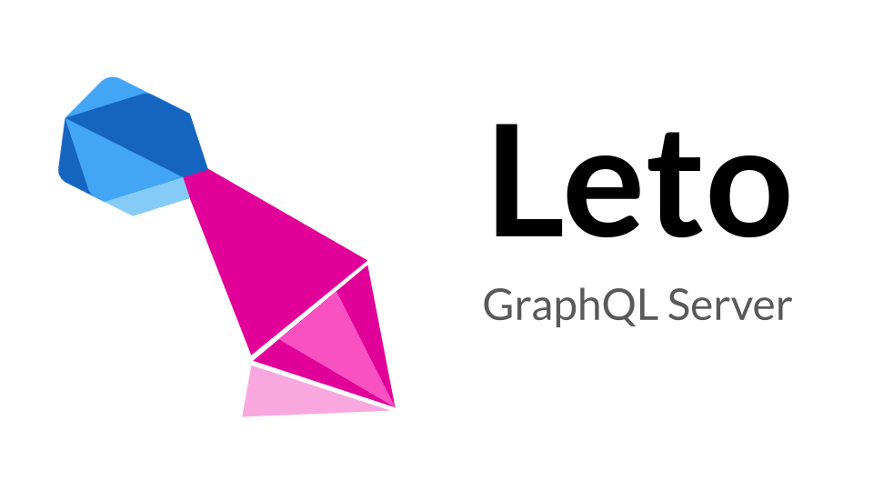

<div style="text-align: center">
<hr>
<a href="https://pub.dartlang.org/packages/leto">
  
</a>

<a href="https://codecov.io/gh/juancastillo0/leto">
  
</a>

<a href='https://coveralls.io/github/juancastillo0/leto?branch=main'>
  
</a>

<a href="https://github.com/juancastillo0/leto/actions/workflows/test.yaml">
  
</a>

<a href="https://github.com/juancastillo0/leto/actions/workflows/test.yaml">
  
</a>

<a href="https://pub.dev/packages/lint">
  
</a>

<a href="https://github.com/juancastillo0/leto/blob/main/LICENSE">
  
</a>

<a href="#contributing">
  
</a>

<a href="https://juancastillo0.github.io/leto/">
  
</a>

</div>

# Leto - GraphQL Server <!-- omit in toc -->

A complete implementation of the official
[GraphQL specification](https://graphql.github.io/graphql-spec/June2018/)
in the Dart programming language.

Inspired by [graphql-js](https://github.com/graphql/graphql-js), [async-graphql](https://github.com/async-graphql/async-graphql) and [type-graphql](https://github.com/MichalLytek/type-graphql). First version of the codebase was forked from [angel-graphql](https://github.com/angel-dart-archive/graphql). Many tests and utilities ([DataLoader](https://github.com/graphql/dataloader), [printSchema](https://github.com/graphql/graphql-js/blob/10c1c3d6cd8e165501fb1471b5babfabd1be1eb1/src/utilities/printSchema.ts)) were ported from graphql-js.

If your prefer to read the documentation in a web page, you can [try the documentation page](https://juancastillo0.github.io/leto/) built with Docusaurus.

## Table of Contents
- [Quickstart](#quickstart)
  - [Install](#install)
  - [Create a `GraphQLSchema`](#create-a-graphqlschema)
    - [Using Code Generation](#using-code-generation)
  - [Start the server](#start-the-server)
  - [Test the server](#test-the-server)
- [Examples](#examples)
  - [Code Generator example](#code-generator-example)
  - [Fullstack Dart Chat](#fullstack-dart-chat)
    - [Chat functionalities](#chat-functionalities)
  - [Server example](#server-example)
  - [Room Signals](#room-signals)
  - [CI & CD Dart Server](#ci--cd-dart-server)
- [Packages](#packages)
- [Web integrations](#web-integrations)
  - [Server integrations](#server-integrations)
    - [Shelf](#shelf)
  - [Web UI Explorers](#web-ui-explorers)
    - [GraphiQL](#graphiql)
    - [Playground](#playground)
    - [Altair](#altair)
  - [Clients](#clients)
- [Documentation](#documentation)
- [GraphQL Schema Types](#graphql-schema-types)
  - [Scalars](#scalars)
  - [Enums](#enums)
  - [Objects](#objects)
    - [Interfaces](#interfaces)
  - [Inputs and Input Objects](#inputs-and-input-objects)
    - [InputObject.isOneOf](#inputobjectisoneof)
    - [InputObject.fromJson](#inputobjectfromjson)
  - [Unions](#unions)
    - [Freezed Unions](#freezed-unions)
  - [Wrapping Types](#wrapping-types)
  - [Non-Nullable](#non-nullable)
  - [Lists](#lists)
  - [Abstract Types](#abstract-types)
    - [resolveType](#resolvetype)
    - [Generics](#generics)
    - [isTypeOf](#istypeof)
    - [\_\_typename](#__typename)
    - [Serialize and validate](#serialize-and-validate)
  - [Advanced Types](#advanced-types)
    - [Provided Types](#provided-types)
    - [Cyclic Types](#cyclic-types)
    - [Custom Scalars](#custom-scalars)
    - [Generic Types](#generic-types)
- [Resolvers](#resolvers)
  - [Queries and Mutations](#queries-and-mutations)
  - [Subscriptions](#subscriptions)
    - [Examples](#examples-1)
  - [Request Contexts](#request-contexts)
    - [Ctx](#ctx)
    - [ObjectExecutionCtx](#objectexecutionctx)
    - [ExecutionCtx](#executionctx)
    - [RequestCtx](#requestctx)
- [Validation](#validation)
  - [Schema Validation](#schema-validation)
  - [Document Validation](#document-validation)
  - [Query Complexity](#query-complexity)
  - [Skip validation with Persisted Queries](#skip-validation-with-persisted-queries)
  - [Input Validation](#input-validation)
- [Miscellaneous](#miscellaneous)
  - [`GraphQLResult`](#graphqlresult)
  - [`ScopedMap`](#scopedmap)
    - [`ScopedHolder`](#scopedholder)
    - [`ScopedRef`](#scopedref)
    - [Example usage](#example-usage)
  - [Error Handling](#error-handling)
    - [Exceptions and `GraphQLError`](#exceptions-and-graphqlerror)
    - [Result types](#result-types)
    - [Error lists and interfaces](#error-lists-and-interfaces)
  - [Hot Reload and Cycles](#hot-reload-and-cycles)
- [Solving the N+1 problem](#solving-the-n1-problem)
  - [LookAhead (Eager loading)](#lookahead-eager-loading)
  - [DataLoader (Batching)](#dataloader-batching)
  - [Combining LookAhead with DataLoader](#combining-lookahead-with-dataloader)
- [Extensions](#extensions)
  - [Persisted Queries](#persisted-queries)
  - [Apollo Tracing](#apollo-tracing)
  - [Response Cache](#response-cache)
  - [Logging Extension](#logging-extension)
  - [Map Error Extension](#map-error-extension)
  - [Custom Extensions](#custom-extensions)
- [Directives](#directives)
  - [`KeyDirective`](#keydirective)
  - [`ValidaDirective`](#validadirective)
- [Attachments](#attachments)
  - [AttachmentWithValidation](#attachmentwithvalidation)
  - [ToDirectiveValue](#todirectivevalue)
    - [`KeyAttachment`](#keyattachment)
    - [`ValidaAttachment`](#validaattachment)
  - [Usage](#usage)
    - [AttachFn for code generation](#attachfn-for-code-generation)
- [Utilities](#utilities)
    - [`buildSchema`](#buildschema)
    - [`printSchema`](#printschema)
    - [`extendSchema`](#extendschema)
    - [`introspectionQuery`](#introspectionquery)
    - [`mergeSchemas`](#mergeschemas)
    - [`schemaFromJson`](#schemafromjson)
- [Contributing](#contributing)
  - [Scripts](#scripts)
    - [`collect_examples.dart`](#collect_examplesdart)
    - [`generate_docusaurus.dart`](#generate_docusaurusdart)

# Quickstart <!-- docusaurus{"tags":["tutorial"]} -->

This provides a simple introduction to Leto, you can explore more in the following sections of this README or by looking at the tests, documentation and examples for each package. A fullstack Dart example with Flutter client and Leto/Shelf server can be found in https://github.com/juancastillo0/leto/tree/main/chat_example

The source code for this quickstart can be found in https://github.com/juancastillo0/leto/blob/main/leto_shelf/example/lib/quickstart_server.dart.

## Install

Add dependencies to your pubspec.yaml

All packages haven't been published at the moment. You can use them directly from git as explained in this [issue](https://github.com/juancastillo0/leto/issues/3) or you could also clone the repository locally and use relative dependencies like this [example](https://github.com/juancastillo0/leto/blob/df12485d0edc4e2d1016a581113c3411922137c5/chat_example/server/pubspec.yaml).

```yaml
dependencies:
  leto_schema: ^0.0.1
  leto: ^0.0.1
  leto_shelf: ^0.0.1
  shelf: ^1.0.0
  shelf_router: ^1.0.0
  # Not nessary for the server, just for testing it
  http: ^1.0.0

dev_dependencies:
  # Only if you use code generation
  leto_generator: ^0.0.1
  build_runner: ^2.0.0
```

## Create a `GraphQLSchema`


Specify the logic for your server, this could be anything such as accessing a database, reading a file or sending an http request. We will use a controller class with a stream that emits events on mutation to support subscriptions.

<!-- include{quickstart-controller-state-definition} -->
```dart
// this annotations is only necessary for code generation
@GraphQLObject()
class Model {
  final String state;
  final DateTime createdAt;

  const Model(this.state, this.createdAt);
}

/// Set up your state.
/// This could be anything such as a database connection.
/// 
/// Global means that there will only be one instance of [ModelController]
/// for this reference. As opposed to [ScopedRef.local] where there will be
/// one [ModelController] for each request (for saving user information
/// or a [DataLoader], for example).
final stateRef = ScopedRef<ModelController>.global(
  (scope) => ModelController(
    Model('InitialState', DateTime.now()),
  ),
);

class ModelController {
  Model? _value;
  Model? get value => _value;

  final _streamController = StreamController<Model>.broadcast();
  Stream<Model> get stream => _streamController.stream;

  ModelController(this._value);

  void setValue(Model newValue) {
    if (newValue.state == 'InvalidState') {
      // This will appear as an GraphQLError in the response.
      // You can pass more information using custom extensions.
      throw GraphQLError(
        "Can't be in InvalidState.",
        extensions: {'errorCodeExtension': 'INVALID_STATE'},
      );
    }
    _value = newValue;
    _streamController.add(newValue);
  }
}
```
<!-- include-end{quickstart-controller-state-definition} -->

With the logic that you want to expose, you can create the GraphQLSchema instance and access the controller state using the `Ctx` for each resolver and the `ScopedRef.get` method. The following is a schema with Query, Mutation and Subscription with a simple model. However, GraphQL is a very expressive language with [Unions](#unions), [Enums](#enums), [complex Input Objects](#inputs-and-input-objects), [collections](#wrapping-types) and more. For more documentation on writing GraphQL Schemas with Leto you can read the following sections, tests and examples for each package.

To expose this logic, we could implement the following GraphQL API:

<!-- include{quickstart-schema-string} -->
```graphql
type Query {
  """Get the current state"""
  getState: Model
}

type Model {
  state: String!
  createdAt: Date!
}

"""An ISO-8601 Date."""
scalar Date

type Mutation {
  setState(
    """The new state, can't be 'WrongState'!."""
    newState: String!
  ): Boolean!
}

type Subscription {
  onStateChange: Model!
}
```
<!-- include-end{quickstart-schema-string} -->

This could be exposed by using `package:leto_schema` API as shown in the following code sample or more simply by [using code generation](#using-code-generation).

<!-- include{quickstart-make-schema} -->
```dart
/// Create a [GraphQLSchema].
/// All of this can be generated automatically using `package:leto_generator`
GraphQLSchema makeGraphQLSchema() {
  // The [Model] GraphQL Object type. It will be used in the schema
  final GraphQLObjectType<Model> modelGraphQLType = objectType<Model>(
    'Model',
    fields: [
      // All the fields that you what to expose
      graphQLString.nonNull().field(
            'state',
            resolve: (Model model, Ctx ctx) => model.state,
          ),
      graphQLDate.nonNull().field(
            'createdAt',
            resolve: (Model model, Ctx ctx) => model.createdAt,
          ),
    ],
  );
  // The executable schema. The `queryType`, `mutationType`
  // and `subscriptionType` are should be GraphQL Object types
  final schema = GraphQLSchema(
    queryType: objectType('Query', fields: [
      // Use the created [modelGraphQLType] as the return type for the
      // "getState" root Query field
      modelGraphQLType.field(
        'getState',
        description: 'Get the current state',
        resolve: (Object? rootValue, Ctx ctx) => stateRef.get(ctx).value,
      ),
    ]),
    mutationType: objectType('Mutation', fields: [
      graphQLBoolean.nonNull().field(
        'setState',
        // set up the input field. could also be done with
        // `graphQLString.nonNull().inputField('newState')`
        inputs: [
          GraphQLFieldInput(
            'newState',
            graphQLString.nonNull(),
            description: "The new state, can't be 'WrongState'!.",
          ),
        ],
        // execute the mutation
        resolve: (Object? rootValue, Ctx ctx) {
          final newState = ctx.args['newState']! as String;
          if (newState == 'WrongState') {
            return false;
          }
          stateRef.get(ctx).setValue(Model(newState, DateTime.now()));
          return true;
        },
      ),
    ]),
    subscriptionType: objectType('Subscription', fields: [
      // The Subscriptions are the same as Queries and Mutations as above,
      // but should use `subscribe` instead of `resolve` and return a `Steam`
      modelGraphQLType.nonNull().field(
            'onStateChange',
            subscribe: (Object? rootValue, Ctx ctx) => stateRef.get(ctx).stream,
          )
    ]),
  );
  assert(schema.schemaStr == schemaString.trim());
  return schema;
}

```
<!-- include-end{quickstart-make-schema} -->

// TODO: 1T
type CompilerLog {
  toString: String!

TODO: 1T class ProcessExecResult implements ProcessResult {
[WARNING] leto_generator:graphql_types on lib/src/compiler_models.dart:
Cannot infer the GraphQLType for field ProcessResult.stdout (type=dynamic). Please annotate the Dart type, provide a dynamic.graphQLType static getter or add the type to `build.yaml` "customTypes" property.
[WARNING] leto_generator:graphql_types on lib/src/compiler_models.dart:
Cannot infer the GraphQLType for field ProcessResult.stderr (type=dynamic). Please annotate the Dart type, provide a dynamic.graphQLType static getter or add the type to `build.yaml` "customTypes" property.

### Using Code Generation

You can use code generation to create a function similar to `makeGraphQLSchema` with the following resolver definitions with annotations.

<!-- include{quickstart-make-schema-code-gen} -->
```dart
/// Code Generation
/// Using leto_generator, [makeGraphQLSchema] could be generated
/// with the following annotated functions and the [GraphQLObject]
/// annotation over [Model]

/// Get the current state
@Query()
Model? getState(Ctx ctx) {
  return stateRef.get(ctx).value;
}

@Mutation()
bool setState(
  Ctx ctx,
  // The new state, can't be 'WrongState'!.
  String newState,
) {
  if (newState == 'WrongState') {
    return false;
  }

  stateRef.get(ctx).setValue(Model(newState, DateTime.now()));
  return true;
}

@Subscription()
Stream<Model> onStateChange(Ctx ctx) {
  return stateRef.get(ctx).stream;
}
```
<!-- include-end{quickstart-make-schema-code-gen} -->

This generates the same `modelGraphQLType` in `<file>.g.dart` and `graphqlApiSchema` in 'lib/graphql_api.schema.dart' (TODO: 1G configurable). The documentation comments will be used as description in the generated schema. More information on code generation can be found in the following sections, in the `package:leto_generator`'s [README](https://github.com/juancastillo0/leto/tree/main/leto_generator) or in the code generation [example](https://github.com/juancastillo0/leto/tree/main/leto_generator/example).

## Start the server

With the `GraphQLSchema` and the resolver logic implemented, we can set up the shelf handlers for each route. In this case we will use the `graphQLHttp` handlers for the "/graphql" endpoint and `graphQLWebSocket` for "/graphql-subscription" which supports subscriptions. You could provide custom extensions, document validations or a `ScopedMap` to override the state in the `GraphQL` executor constructor.

<!-- include{quickstart-setup-graphql-server} -->
```dart
Future<HttpServer> runServer({int? serverPort, ScopedMap? globals}) async {
  // you can override state with ScopedMap.setGlobal/setScoped
  final ScopedMap scopedMap = globals ?? ScopedMap();
  if (globals == null) {
    // if it wasn't overridden it should be the default
    assert(stateRef.get(scopedMap).value?.state == 'InitialState');
  }
  // Instantiate the GraphQLSchema
  final schema = makeGraphQLSchema();
  // Instantiate the GraphQL executor, you can pass extensions and
  // decide whether you want to introspect the schema
  // and validate the requests
  final letoGraphQL = GraphQL(
    schema,
    extensions: [],
    introspect: true,
    globalVariables: scopedMap,
  );

  final port =
      serverPort ?? const int.fromEnvironment('PORT', defaultValue: 8080);
  const graphqlPath = 'graphql';
  const graphqlSubscriptionPath = 'graphql-subscription';
  final endpoint = 'http://localhost:$port/$graphqlPath';
  final subscriptionEndpoint = 'ws://localhost:$port/$graphqlSubscriptionPath';

  // Setup server endpoints
  final app = Router();
  // GraphQL HTTP handler
  app.all(
    '/$graphqlPath',
    graphQLHttp(letoGraphQL),
  );
  // GraphQL WebSocket handler
  app.all(
    '/$graphqlSubscriptionPath',
    graphQLWebSocket(
      letoGraphQL,
      pingInterval: const Duration(seconds: 10),
      validateIncomingConnection: (
        Map<String, Object?>? initialPayload,
        GraphQLWebSocketShelfServer wsServer,
      ) {
        if (initialPayload != null) {
          // you can authenticated an user with the initialPayload:
          // final token = initialPayload['token']! as String;
          // ...
        }
        return true;
      },
    ),
  );
```
<!-- include-end{quickstart-setup-graphql-server} -->

In the shelf router you can specify other handlers such as static files or other utilities. In the following code we set up a [GraphQL UI explorer](#web-ui-explorers) in the "/playground" route using the `playgroundHandler` handler and a "/graphql-schema" endpoint that returns the GraphQL schema String in the body of the response.

<!-- include{quickstart-setup-graphql-server-utilities} -->
```dart
  // GraphQL schema and endpoint explorer web UI.
  // Available UI handlers: playgroundHandler, graphiqlHandler and altairHandler
  app.get(
    '/playground',
    playgroundHandler(
      config: PlaygroundConfig(
        endpoint: endpoint,
        subscriptionEndpoint: subscriptionEndpoint,
      ),
    ),
  );
  // Simple endpoint to download the GraphQLSchema as a SDL file.
  // $ curl http://localhost:8080/graphql-schema > schema.graphql
  const downloadSchemaOnOpen = true;
  const schemaFilename = 'schema.graphql';
  app.get('/graphql-schema', (Request request) {
    return Response.ok(
      schema.schemaStr,
      headers: {
        'content-type': 'text/plain',
        'content-disposition': downloadSchemaOnOpen
            ? 'attachment; filename="$schemaFilename"'
            : 'inline',
      },
    );
  });
```
<!-- include-end{quickstart-setup-graphql-server-utilities} -->

Once you set up all the handlers, you can start the server adding middlewares if necessary. In this example, we will use the `etag` and `cors` middlewares from `package:leto_shelf`. You can read more about them in the [package's README](https://github.com/juancastillo0/leto/tree/main/leto_shelf).

<!-- include{quickstart-start-server} -->
```dart
  // Set up other shelf handlers such as static files

  // Start the server
  final server = await shelf_io.serve(
    const Pipeline()
        // Configure middlewares
        .addMiddleware(customLog(log: (msg) {
          // TODO: 2A detect an introspection query.
          //  Add more structured logs and headers
          if (!msg.contains('IntrospectionQuery')) {
            print(msg);
          }
        }))
        .addMiddleware(cors())
        .addMiddleware(etag())
        .addMiddleware(jsonParse())
        // Add Router handler
        .addHandler(app),
    '0.0.0.0',
    port,
  );
  print(
    'GraphQL Endpoint at $endpoint\n'
    'GraphQL Subscriptions at $subscriptionEndpoint\n'
    'GraphQL Playground UI at http://localhost:$port/playground',
  );

  return server;
}
```
<!-- include-end{quickstart-start-server} -->

With the `runServer` function finished, we can now create a main function that executes it and servers the implemented logic in a GraphQL server. This function can also be used for test as shown in the `testServer` function from the next section. 

<!-- include{quickstart-main-fn} -->
```dart
Future<void> main() async {
  final server = await runServer();
  final url = Uri.parse('http://${server.address.host}:${server.port}/graphql');
  await testServer(url);
}
```
<!-- include-end{quickstart-main-fn} -->

## Test the server

You can test the server programmatically by sending HTTP requests to the server. You could also test the GraphQL executor directly using the `GraphQL.parseAndExecute` function without running the shelf server.

<!-- include{quickstart-test-server} -->
```dart
/// For a complete GraphQL client you probably want to use
/// Ferry (https://github.com/gql-dart/ferry)
/// Artemis (https://github.com/comigor/artemis)
/// or raw GQL Links (https://github.com/gql-dart/gql/tree/master/links)
Future<void> testServer(Uri url) async {
  final before = DateTime.now();
  const newState = 'NewState';
  // POST request which sets the state
  final response = await http.post(
    url,
    body: jsonEncode({
      'query':
          r'mutation setState ($state: String!) { setState(newState: $state) }',
      'variables': {'state': newState}
    }),
    headers: {'content-type': 'application/json'},
  );
  assert(response.statusCode == 200);
  final body = jsonDecode(response.body) as Map<String, Object?>;
  final data = body['data']! as Map<String, Object?>;
  assert(data['setState'] == true);

  // Also works with GET
  final responseGet = await http.get(url.replace(
    queryParameters: <String, String>{
      'query': '{ getState { state createdAt } }'
    },
  ));
  assert(responseGet.statusCode == 200);
  final bodyGet = jsonDecode(responseGet.body) as Map<String, Object?>;
  final dataGet = bodyGet['data']! as Map<String, dynamic>;
  assert(dataGet['getState']['state'] == newState);
  final createdAt = DateTime.parse(dataGet['getState']['createdAt'] as String);
  assert(createdAt.isAfter(before));
  assert(createdAt.isBefore(DateTime.now()));

  // To test subscriptions you can open the playground web UI at /playground
  // or programmatically using https://github.com/gql-dart/gql/tree/master/links/gql_websocket_link,
  // an example can be found in test/mutation_and_subscription_test.dart
}
```
<!-- include-end{quickstart-test-server} -->

Test and explore the server manually in the explorer interface "http://localhost:8080/playground". It supports subscriptions, subscribe in one tab and send a mutation request in another to test it. There are other UI explorers that you can set up (for example, GraphiQL and Altair), for more information [Web UI explorers section](#web-ui-explorers).

We also set up a "http://localhost:8080/graphql-schema" endpoint which returns the GraphQL schema String in the schema definition language, this could be useful for other tools such as client side code generators.

# Examples

Beside the tests from each package, you can find some usage example in the following directories and external repositories:


## Code Generator example

An example with multiple ways of creating a GraphQLSchema with different GraphQL types and resolvers from code generation can be found in https://github.com/juancastillo0/leto/tree/main/leto_generator/example.


## Fullstack Dart Chat

A fullstack Dart example with Flutter client and Leto/Shelf server can be found in https://github.com/juancastillo0/leto/tree/main/chat_example. The server is in the [server](https://github.com/juancastillo0/leto/tree/main/chat_example/server) folder.

- Sqlite3 and Postgres database integrations
- Subscriptions
- Authentication/Authorization
- Sessions
- Tests
- File uploads
- Client/Server GraphQL extensions integration
- Docker

### Chat functionalities

- Send/receive/delete messages in realtime
  - File uploads
  - Link metadata
  - Reply to other messages
- Client cache through [Ferry](https://github.com/gql-dart/ferry) and [Hive](https://github.com/hivedb/hive)
- Create chat rooms, add/remove users and share authorized invite links
- View complete usage history with events for the most important mutations
- View all user sessions

## Server example

A Leto/Shelf server example with multiple models, code generation, some utilities and tests can be found in https://github.com/juancastillo0/leto/tree/main/leto_shelf/example

## Room Signals

A service with room and messages, an user can subscribe to a room to listen to messages and send private or group-wide messages. Useful for simple messages or setting up peer-to-peer protocols like WebRTC. The service uses web sockets and in the source code repository there are three projects:

1. The Leto Shelf GraphQL server. Everything is saved in memory
2. A Dart client using [Artemis](https://github.com/comigor/artemis)
3. A Web Dart client using [`package:rad`](https://github.com/erlage/rad)

You can view the code in the [Github repo](https://github.com/juancastillo0/room_signals). The client UI and some links to the different GraphQL Schema UI explorer is deployed in [this page](https://juancastillo0.github.io/room_signals/).

## CI & CD Dart Server

Work in Progress

A service for compiling, executing and tracking the build process and deployment. With a git repository, one can set up a CLI pipeline for continuous integration and delivery. All the commands are tracked in realtime. This is a simple personal project for deploying in a VM. The service uses web sockets and the source code repository has three projects:

1. The Leto Shelf GraphQL server. Everything is saved in memory
2. A Dart client using [`package:graphql`](https://pub.dev/packages/graphql) and [`package:graphql_codegen`](https://pub.dev/packages/graphql_codegen)
3. A Web Dart client using [`package:jaspr`](https://github.com/schultek/jaspr)

You can view the code in the [Github repo](https://github.com/juancastillo0/cidart). The client UI and some links to the different GraphQL Schema UI explorer is deployed in [this page](https://juancastillo0.github.io/cidart/).


# Packages

This repository is a monorepo with the following packages

| Pub                                                                                                    | Source                             | Description                                                                                |
| ------------------------------------------------------------------------------------------------------ | ---------------------------------- | ------------------------------------------------------------------------------------------ |
| [](https://pub.dev/packages/leto)                     | [leto](./leto)                     | GraphQL server (executor) implementation, GraphQL extensions and DataLoader                |
| [](https://pub.dev/packages/leto_schema)       | [leto_schema](./leto_schema)       | Define GraphQL executable schemas, validate GraphQL documents and multiple utilities       |
| [](https://pub.dev/packages/leto_generator) | [leto_generator](./leto_generator) | Generate GraphQL schemas, types and fields from Dart code annotations                      |
| [](https://pub.dev/packages/leto_shelf)         | [leto_shelf](./leto_shelf)         | GraphQL web server bindings and utilities for  [shelf](https://github.com/dart-lang/shelf) |
| [](https://pub.dev/packages/leto_links)         | [leto_links](./leto_links)         | Client gql links, support for GraphQL extensions defined in package:leto                   |

# Web integrations

Although you can use `package:leto_schema` to create and validate schemas and `package:leto` to execute GraphQL requests in any Dart application, GraphQL servers are usually deployed to the web. We provide a couple of utilities and integrations for creating and using GraphQL web servers powered by Leto.

## Server integrations

### [Shelf](https://github.com/juancastillo0/leto/tree/main/leto_shelf)

Using the [shelf](https://github.com/dart-lang/shelf) package.

- [HTTP](https://graphql.org/learn/serving-over-http/) POST and GET
- [Mutipart requests](https://github.com/jaydenseric/graphql-multipart-request-spec) for file Upload.
- Subscriptions through WebSockets. Supporting [graphql-ws](https://github.com/apollographql/subscriptions-transport-ws/blob/master/PROTOCOL.md) and [graphql-transport-ws](https://github.com/enisdenjo/graphql-ws/blob/master/PROTOCOL.md) subprotocols
- Batched queries
- TODO: HTTP/2 example
- TODO: [Server-Sent Events](https://the-guild.dev/blog/graphql-over-sse)

## Web UI Explorers

These web pages will allow you to explore your GraphQL Schema, view all the types and fields, read each element's documentation, and execute requests against a GraphQL server. 

Usually exposed as static HTML in your deployed server. Each has multiple configurations for determining the default tabs, queries and variables, the GraphQL HTTP and WebSocket (subscription) endpoints, the UI's theme and more.

All of the static HTML files and configurations can be found in the [graphql_ui folder](https://github.com/juancastillo0/leto/tree/main/leto_shelf/lib/src/graphql_ui).

### GraphiQL

[Documentation](https://github.com/graphql/graphiql/tree/main/packages/graphiql#readme). Use `graphiqlHandler`. The classic GraphQL explorer
### Playground

[Documentation](https://github.com/graphql/graphql-playground). Use `playgroundHandler`. Support for multiple tabs, subscriptions.
### Altair

[Documentation](https://github.com/altair-graphql/altair). Use `altairHandler`. Support for file Upload, multiple tabs, subscriptions, plugins.


## Clients

For a complete GraphQL client you probably want to use:

- Ferry (https://github.com/gql-dart/ferry)
- Artemis (https://github.com/comigor/artemis)
- `package:graphql` (https://pub.dev/packages/graphql) with `package:graphql_codegen` (https://pub.dev/packages/graphql_codegen)
- or raw gql Links (https://github.com/gql-dart/gql/tree/master/links)
  
  gql Links are used by Ferry and Artemis, both of which provide additional functionalities over raw gql Links like serialization and deserialization, code generation, type safety, normalized caching and more.

# Documentation

The following sections introduce most of the concepts and small examples of building GraphQL executable schemas and servers with Leto. Please, if there is something that may be missing from the documentation or you have any question you can make an issue, that would help us a lot.

If your prefer to read the documentation in a web page, you can [try the documentation page](https://juancastillo0.github.io/leto/) built with Docusaurus.

# GraphQL Schema Types <!-- docusaurus{"global":true} -->

The GraphQL language provides multiple types for representing your exposed API and the required data structures for the input values. In the following sections we explain their usage within Leto and, in general, for GraphQL. Each section contains a link to the official GraphQL specification for more information.

[GraphQL Specification](http://spec.graphql.org/draft/#sec-Schema)

## Scalars

The fundamental building-block in the type system. Standard `GraphQLScalarType`s: String, Int, Float, Boolean and ID types are already implemented and provided by Leto.

[GraphQL Specification](http://spec.graphql.org/draft/#sec-Scalars)

Other scalar types are also provided:

- Json: A raw JSON value with no type schema. Could be a Map<String, Json\>, List<Json\>, num, String, bool or null.
- Uri: Dart's Uri class, serialized using `Uri.toString` and deserialized with `Uri.parse`
- Date: Uses the `DateTime` Dart class. Serialized as an [ISO-8601](https://en.wikipedia.org/wiki/ISO_8601) String and deserialized with `DateTime.parse`.
- Timestamp: Same as Date, but serialized as an UNIX timestamp.
- Time: // TODO: 1A
- Duration: // TODO: 1A
- BigInt: An arbitrarily large integer from [`dart:core`](https://api.dart.dev/stable/dart-core/BigInt-class.html) serialized as a String and deserialized with `BigInt.parse`.
- Upload: A file upload. Following the [multipart request spec](https://github.com/jaydenseric/graphql-multipart-request-spec).

To provide your own or support types from other packages you can use [Custom Scalars](#custom-scalars).

## Enums

Enums are text values which are restricted to a set of predefined variants. Their behavior is similar to scalars and they don't have a nested fields.

[GraphQL Specification](http://spec.graphql.org/draft/#sec-Enums)

They require a unique name and a set of entries mapping their string representation to the Dart value obtained after parsing.

```graphql
"""The error reason on a failed sign up attempt"""
enum SignUpError {
    usernameTooShort,
    usernameNotFound,
    wrongPassword,
    passwordTooSimple,
}
```

```dart
import 'package:leto/leto.dart';

final signUpErrorGraphQLType = enumTypeFromStrings(
  'SignUpError', 
  [
    'usernameTooShort',
    'usernameNotFound',
    'wrongPassword',
    'passwordTooSimple',
  ],
  description: 'The error reason on a failed sign up attempt',
);


// Or with code generation

/// The error reason on a failed sign up attempt
@GraphQLEnum()
enum SignUpError {
    usernameTooShort,
    usernameNotFound,
    wrongPassword,
    passwordTooSimple,
}

```
## Objects

GraphQL objects allow you to specify a type with a set of fields or properties. Objects can only be outputs in a resolver. Each field can be of any output type.

[GraphQL Specification](http://spec.graphql.org/draft/#sec-Objects)

The Query, Mutation and Subscription types in the schema are specified using GraphQL objects.

```dart
final type = objectType(
  'ObjectTypeName',
  fields: [],
);
```

- With code generation

```dart
@GraphQLObject()
@JsonSerializable()
class Model {
  final String stringField;
  final int intField;
  final List<Model>? optionalModels;

  const Model({
    required this.stringField,
    required this.intField,
    required this.optionalModels,
  });
}

@Query
Future<Model> getModel(Ctx ctx) {

}
```

This would generate graphql_api.schema.dart

```dart

```


### Interfaces

[GraphQL Specification](http://spec.graphql.org/draft/#sec-Interfaces)

- inheritFrom

The `inheritFrom` function in `GraphQLObjectType` receives an Interface and assigns it's argument as  
a super type, now the Object will implement the Interface passed as parameter.

## Inputs and Input Objects

Input types specify the structure of the values that inputs to resolvers should have. Scalars and Enums can be passed as input to resolvers. Wrapper types such as List and NonNull types of Scalars and Enums, also can be passed, however for more complex Objects with nested fields you will need to use `GraphQLInputObjectType`. Similar `GraphQLObjectType`, a `GraphQLInputObjectType` can have fields.

[GraphQL Specification](http://spec.graphql.org/draft/#sec-Input-Objects)

// TODO: 1A customDeserialize with SerdeCtx deserializers

```dart
final inputModel = GraphQLInputObjectType(
  'ModelInput',
  description: '',
  inputs: [

  ],
);
```

Field inputs (or Arguments) can be used in multiple places:

- `GraphQLObjectType.fields.inputs`: Inputs in field resolvers

- `GraphQLInputObjectType.fields`: Fields in Input Objects

- `GraphQLDirective.inputs`: Inputs in directives

Not all types can be input types, in particular, object types and union types can't be input types nor part of a `GraphQLInputObjectType`.

```dart
static bool isInputType(GraphQLType type) {
  return type.when(
    enum_: (type) => true,
    scalar: (type) => true,
    input: (type) => true,
    object: (type) => false,
    union: (type) => false,
    list: (type) => isInputType(type.ofType),
    nonNullable: (type) => isInputType(type.ofType),
  );
}
```

### Example <!-- omit in toc -->

```graphql
input ComplexInput {
  value: String!
}

# The fields:
(
  """The amount"""
  @deprecated
  amount: Int = 2
  names: [String!]
  complex: ComplexInput!
)
```

```dart
@GraphQLInput()
class ComplexInput {
  const ComplexInput({required this.value});
  /// The value
  final String value;

  factory ComplexInput.fromJson(Map<String, Object?> json) =>
    ComplexInput(
      value: json['value']! as String,
    );
}

final fields = [
  GraphQLFieldInput(
    'amount',
    graphQLInt,
    defaultValue: 2,
    description: 'The amount',
    // an empty String will use the default deprecation reason
    deprecationReason: '',
  ),
  GraphQLFieldInput(
    'names',
    listOf(graphQLString.nonNull()),
  ),
  GraphQLFieldInput(
    'complex',
    complexInputGraphQLInputType.nonNull(),
  ),
];

// can be used in:
// - `GraphQLObjectType.fields.inputs`
// - `GraphQLInputObjectType.fields`
// - 'GraphQLDirective.inputs'

final object = GraphQLObjectType(
  'ObjectName',
  fields: [
    stringGraphQLType.field(
      'someField',
      inputs: fields,
      resolve: (_, Ctx ctx) {
        final Map<String, Object?> args = ctx.args;
        assert(args.containKey('complex'));
        assert(args['names'] is List<String>?);
        assert(args['amount'] is int?);
        return '';
      }
    )
  ]
);

final objectInput = GraphQLInputObjectType(
  'InputObjectName',
  fields: fields,
  // ...
);

final directive = GraphQLDirective(
  name: 'DirectiveName',
  inputs: fields,
  // ...
);
```

### InputObject.isOneOf

[Discussion](https://github.com/graphql/graphql-spec/pull/825)

oneOf input object types allow you to specify that an object should contain only one of the provided fields. The fields should be nullable and should not have a default value. This is similar to [union](#unions) types. However, oneOf input types can be used as inputs and their variants (or fields) can be any input type such as a custom scalar, they are not constrained to object types.

```graphql
input EmailPassword {
  email: String!
  password: String!
}

input LogInOption @oneOf {
  email: EmailPassword
  token: String
}

type Mutation {
  login(option: LogInOption!): Boolean!
}

mutation loginMut {
  login(option: { email: { email: "email@example.com" password: "pass" } })
}
```

### InputObject.fromJson

For code generation, each class annotated as `GraphQLInput` should have a factory constructor or static method name `fromJson` in its class definition. This will be used as the method for deserializing instances of this class.

## Unions

Similar to enums, Unions are restricted to a set of predefined variants, however the possible types are always the more complex `GraphQLObjectType`.

Per the GraphQL spec, Unions can't be (or be part of) Input types and their possible types is a non empty collection of unique `GraphQLObjectType`.

[GraphQL Specification](http://spec.graphql.org/draft/#sec-Unions)

To have the following GraphQL type definitions:

```graphql
union ModelEvent = ModelAdded | ModelRemoved

type ModelRemoved {
  "The removed model id"
  modelId: ID!
}

type ModelAdded {
  model: Model!
}

type Model {
  id: ID!
}
```

You could provide this definitions:

```dart
import 'package:leto_schema/leto_schema.dart';

final model = objectType(
  'Model',
  fields: [
      graphQLIdType.nonNull().field('id'),
  ],
);
final modelAddedGraphQLType = objectType(
  'ModelAdded',
  fields: [model.nonNull().field('model')],
);
final modelRemovedGraphQLType = objectType(
  'ModelRemoved',
  fields: [graphQLIdType.nonNull().field('modelId')],
);

final union = GraphQLUnionType(
  // name
  'ModelEvent',
  // possibleTypes
  [
      modelAddedGraphQLType,
      modelRemovedGraphQLType,
  ],
);
```

- `extractInner`

When the members of the union type are not

### Freezed Unions

With code generation, Unions with [freezed](https://github.com/rrousselGit/freezed) also work without trouble.

```dart
import 'package:leto_schema/leto_schema.dart';
import 'package:freezed_annotation/freezed_annotation.dart';

@GraphQLObject()
class Model {
  final String id;

  const Model(this.id);
}

@GraphQLObject()
@freezed
class ModelEvent with _$ModelEvent {
  const factory ModelEvent.added(Model model) = ModelAdded;
  const factory ModelEvent.removed(
    @GraphQLDocumentation(type: 'graphQLIdType', description: 'The removed model id')
    String modelId,
    // you can also provide a private class
  ) = _ModelRemoved;
}
```

<!-- include{unions-example-generator} -->
```dart
GraphQLAttachments unionNoFreezedAttachments() => const [ElementComplexity(50)];

@AttachFn(unionNoFreezedAttachments)
@GraphQLDocumentation(
  description: '''
Description from annotation.

Union generated from raw Dart classes''',
)
@GraphQLUnion(name: 'UnionNoFreezedRenamed')
class UnionNoFreezed {
  const factory UnionNoFreezed.a(String value) = UnionNoFreezedA.named;
  const factory UnionNoFreezed.b(int value) = UnionNoFreezedB;
}

@GraphQLObject()
class UnionNoFreezedA implements UnionNoFreezed {
  final String value;

  const UnionNoFreezedA.named(this.value);
}

@GraphQLObject()
class UnionNoFreezedB implements UnionNoFreezed {
  final int value;

  const UnionNoFreezedB(this.value);
}

@Query()
List<UnionNoFreezed> getUnionNoFrezzed() {
  return const [UnionNoFreezed.a('value'), UnionNoFreezed.b(12)];
}
```
<!-- include-end{unions-example-generator} -->

## Wrapping Types

Wrapping types allow to modify the behavior of the inner (wrapped) type. The inner types can be of any `GraphQLType` and wrapping types can be Output or Input Types if the wrapped type is an Output or Input type. GraphQL has two wrapping types, `GraphQLNonNullType` and `GraphQLListType`.

## Non-Nullable

`GraphQLNonNullType` allows you to represent a non-nullable or required value. By default, all GraphQL Types are nullable or optional, if you want to represent a required input or specify that a given output is always present (non-null), you want to use the `GraphQLNonNullType` wrapping type.

[GraphQL Specification](http://spec.graphql.org/draft/#sec-Non-Null)


In GraphQL this is represented using the `!` exclamation mark after a given type expression. In Dart you can use the `nonNull()` method present in each `GraphQLType`, which will return a non-nullable `GraphQLNonNullType` with it's inner type, the type from which `nonNull` was called. For example, `graphQLString.nonNull()` will be a `String!` in GraphQL.

## Lists

`GraphQLListType` allows you to represent a collection of values.

[GraphQL Specification](http://spec.graphql.org/draft/#sec-List)

This values can be of any `GraphQLType` and List types can be Output or Input Types if the Wrapped type is an Output or Input type. For example, a List of Union types is an Output type while a List of Strings (scalar types) can be an Output or Input type. You can use the `<type>.list()` method present in each `GraphQLType` or the `listOf(<type>)` global utility function to create a `GraphQLListType`. For example, `graphQLString.list()` will be a `[String]` in GraphQL.

### Example <!-- omit in toc -->

In GraphQL, you can represent it like this:

```graphql
type Model {
  listField(listInput: [String]!): [InterfaceModel!]
}

interface InterfaceModel {
  name: String
}
```

Using Dart:

```dart
import 'package:leto_schema/leto_schema.dart';

abstract class InterfaceModel {
  String get name;
}

class Model {
  List<InterfaceModel>? list(List<String?> listInput) {
    throw Unimplemented();
  }
}

final interfaceModel = objectType<InterfaceModel>(
  'InterfaceModel',
  fields: [
    graphQLString.field(
      'name',
      resolve: (InterfaceModel obj, Ctx ctx) => obj.name,
    )
  ],
  isInterface: true,
);

final model = objectType<Model>(
  'Model',
  fields: [
    interfaceModel.nonNull().list().field(
      'listField',
      inputs: [
        listOf(graphQLString).nonNull().inputField('listInput'),
      ],
      resolve: (Model obj, Ctx ctx) => 
        obj.listField(ctx.args['listInput'] as List<String?>) 
    )
  ]
);

```

With code generation, you just annotate the different classes with `@GraphQLObject()` (or the expected annotation) and the fields and models containing Dart Lists or non-nullable types will be generated using `GraphQLListType` or `GraphQLNonNullType` as required.

```dart
import 'package:leto_schema/leto_schema.dart';

@GraphQLObject()
abstract class InterfaceModel {
  String get name;
}

@GraphQLObject()
class Model {
  List<InterfaceModel>? list(List<String?> listInput) {
    throw Unimplemented();
  }
}
```

## Abstract Types

Abstract types like Interfaces and Unions, require type resolution of its variants on execution. For that, we provide a couple of tools explained in the following sections. You can read the code that executes the following logic in package:leto's `GraphQL.resolveAbstractType` method.

### resolveType

A parameter of Interface and Union types is a function with the signature: `String Function(Object result, T abstractType, ResolveObjectCtx ctx)`. Given a resolved result, the abstract type itself and the ObjectCtx, return the name of the type associated with the result value.

### Generics

We compare the resolved result's Dart type with the possible types generic type parameter, if there is only one match (withing the possible types), that will be the resolved type. This happens very often, specially with code generation or when providing a distinct class for each `GraphQLObjectType`.

This can't be used with Union types which are wrappers over the inner types (like `Result<V, E>` or `Either<L, R>`), since generic type of the possible types (`V` and `E`) will not match the wrapper type (`Result`). For this cases you will need to provide a `resolveType` and `extractInner` callbacks. With freezed-like unions you don't have to do that since the variants extend the union type.

### isTypeOf

If any of the previous fail, you can provide a `isTypeOf` callback for objects, which determine whether a given value is an instance of that `GraphQLObjectType`.

### \_\_typename

If the resolved result is a `Map` and contains a key "\_\_typename", we will use it to resolve the type by comparing it with possible types names. If there is a match, we use the matched type in the next steps of execution.

### Serialize and validate

## Advanced Types

### Provided Types


- PageInfo: Following the [relay connections spec](https://relay.dev/graphql/connections.htm).


### Cyclic Types

Types which use themselves in their definition have to reuse previously created instances. The type's field lists are mutable, which allow you to instantiate the type and then modify the fields of the type. For example, an User with friends:

```dart
class User {
  const User(this.friends);
  final List<User> friends;
}
GraphQLObjectType<User>? _type;
GraphQLObjectType<User> get userGraphQLType {
  if (_type != null) return _type; // return a previous instance
  final type = objectType<User>(
    'User',
    // leave fields empty (or don't pass them)
    fields: [],
  );
  _type = type; // set the cached value
  type.fields.addAll([ // add the fields
    listOf(userGraphQLType.nonNull()).nonNull().field(
      'friends',
      resolve: (obj, _) => obj.friends,
    ),
  ]);
  return type;
}
```

Code generation already does it, so you don't have to worry about it when using it.

### Custom Scalars

You can extend the `GraphQLScalarType` or create an instance directly with `GraphQLScalarTypeValue`. For example, to support the `Decimal` type from https://github.com/a14n/dart-decimal you can use the following code:

<!-- include{custom-scalar-decimal} -->
```dart
import 'package:decimal/decimal.dart';
import 'package:leto_schema/leto_schema.dart';

export 'package:decimal/decimal.dart';

final decimalGraphQLType = GraphQLScalarTypeValue<Decimal, String>(
  name: 'Decimal',
  deserialize: (_, serialized) => decimalFromJson(serialized)!,
  serialize: (value) => decimalToJson(value)!,
  validate: (key, input) => (input is num || input is String) &&
          Decimal.tryParse(input.toString()) != null
      ? ValidationResult.ok(input.toString())
      : ValidationResult.failure(
          ['Expected $key to be a number or a numeric String.'],
        ),
  description: 'A number that allows computation without losing precision.',
  specifiedByURL: null,
);

Decimal? decimalFromJson(Object? value) =>
    value == null ? null : Decimal.parse(value as String);

String? decimalToJson(Decimal? value) => value?.toString();
```
<!-- include-end{custom-scalar-decimal} -->

For code generation you need to provide `customTypes` in the [build.yaml](https://github.com/dart-lang/build/blob/master/docs/faq.md) file of you project:

```yaml
target:
  default:
    builders:
      leto_generator:
        options:
          customTypes:
            - name: "Decimal"
            import: "package:<your_package_name>/<path_to_implementation>.dart"
            getter: "decimalGraphQLType"
```

### Generic Types

Work in progress

```dart

class ErrC<T> {
  final String? message;
  final T value;

  const ErrC(this.value, [this.message]);
}

GraphQLObjectType<ErrC<T?>> errCGraphQlType<T extends Object>(
  GraphQLType<T, Object> tGraphQlType, {
      String? name,
  }
) {
  return objectType(
      name ?? 'ErrC${tGraphQlType is GraphQLTypeWrapper ? (tGraphQlType as GraphQLTypeWrapper).ofType : tGraphQlType}',
      isInterface: false,
      interfaces: [],
      description: null,
    fields: [
      field('message', graphQLString,
          resolve: (obj, ctx) => obj.message,),
      field('value', tGraphQlType,
          resolve: (obj, ctx) => obj.value,)
    ],
  );
}


```

- With code generation (derialization with Generic Input types is not yet supported ISSUE // TODO: 1A)

```dart
import 'package:leto/leto.dart';
part 'errc.g.dart';

@GraphQLObject()
class ErrC<T> {
  final String? message;
  final T value;

  const ErrC(this.value, [this.message]);
}

```

Which generates in 'errc.g.dart':

```dart

Map<String, GraphQLObjectType<ErrC>> _errCGraphQlType = {};

/// Auto-generated from [ErrC].
GraphQLObjectType<ErrC<T>> errCGraphQlType<T extends Object>(
  GraphQLType<T, Object> tGraphQlType,
) {
  final __name =
      'ErrC${tGraphQlType is GraphQLTypeWrapper ? (tGraphQlType as GraphQLTypeWrapper).ofType : tGraphQlType}';
  if (_errCGraphQlType[__name] != null)
    return _errCGraphQlType[__name]! as GraphQLObjectType<ErrC<T>>;

  final __errCGraphQlType = objectType<ErrC<T>>(
      'ErrC${tGraphQlType is GraphQLTypeWrapper ? (tGraphQlType as GraphQLTypeWrapper).ofType : tGraphQlType}',
      isInterface: false,
      interfaces: [],
      description: null);
  _errCGraphQlType[__name] = __errCGraphQlType;
  __errCGraphQlType.fields.addAll(
    [
      field('message', graphQLString,
          resolve: (obj, ctx) => obj.message,
          inputs: [],
          description: null,
          deprecationReason: null),
      field('value', tGraphQlType.nonNull(),
          resolve: (obj, ctx) => obj.value,
          inputs: [],
          description: null,
          deprecationReason: null)
    ],
  );

  return __errCGraphQlType;
}

```

# Resolvers

GraphQL resolvers execute the logic for each field and return the expected value typed according to the schema. In Dart this are functions that receive the parent's object value and the field's [`Ctx`](#ctx), and return the execution result. Simple fields may only return a property of the parent object value. However, there may also be complex resolvers, such as mutations, that validate the input data and create rows in a database, or queries that retrieve multiple rows according to complex authorization logic.

## Queries and Mutations

Each field (`GraphQLObjectField`) in an object type (`GraphQLObjectType`) contains a `resolve` parameter, this will be used to resolve all fields. The first argument to `resolve` with be the parent object, if this field is in the root Query or Mutation Object, the value will be the the root value passed as an argument to `GraphQL.parseAndExecute` and a `SubscriptionEvent` if this is a subscription field (more in the [subscription](#subscriptions) section). The second argument will be the field's [`Ctx`](#ctx), with it you can access defined Refs with `Ref.get(ctx)` and view more information about the resolved field or GraphQL request. When using `package:leto_shelf`, you can access the HTTP request and modify the HTTP response, more information in the [package's README](https://github.com/juancastillo0/leto/tree/main/leto_shelf).


```graphql
type Query {
  someField: String
}

type CustomMutation {
  updateSomething(arg1: Float): Date
}

"""An ISO-8601 Date."""
scalar Date

type schema {
  query: Query
  mutation: CustomMutation
}

```

In Dart:

```dart
final query = objectType(
  'Query',
  fields: [
    graphQLString.field(
      'someField',
      resolve: (Object? rootObject, Ctx ctx) => 'someFieldOutput',
    ),
  ],
);

final customMutation = objectType(
  'CustomMutation',
  fields: [
    graphQLDate.field(
      'updateSomething',
      inputs: [
        graphQLFloat.inputField('arg1')
      ],
      resolve: (Object? rootObject, Ctx ctx) {
        final arg1 = ctx.args['arg1'] as double?;
        return DateTime.now();
      },
    ),
  ],
);

final schema = GraphQLSchema(
  queryType: query,
  mutation: customMutation,
);

```


When using `package:leto_shelf`, POST requests can be used for Queries or Mutations. However, GET requests can only be used for Queries, if a Mutation operation is sent using a GET request, the server will return a 405 status code (MethodNotAllowed) following the [GraphQL over HTTP specification](https://github.com/graphql/graphql-over-http/blob/main/spec/GraphQLOverHTTP.md).


## Subscriptions

Each field (`GraphQLObjectField`) in an object type (`GraphQLObjectType`) contains a `subscribe` parameter that receives the root value and a `Ctx`, and returns a Stream of values of the field's type `Stream<T> Function(Ctx<P> ctx, P parent)`. The Stream of values will be returned in the `data` field of the `GraphQLResult` returned on execution.

If using a WebSocket server, the client should support either `graphql-transport-ws` or `graphql-ws` sub-protocols.

```dart

final apiSchema = GraphQLSchema(
  queryType: objectType('Query'),
  subscriptionType: objectType(
    'Subscription',
    fields: [
      graphQLInt.nonNull().fields(
        'secondsSinceSubscription',
        subscribe: (Ctx ctx, Object rootValue) {
          return Stream.periodic(const Duration(seconds: 1), (secs) {
            return secs;
          });
        }
      ),
    ]
  ),
);

Future<void> main() async {
  final GraphQLResult result = await GraphQL(apiSchema).parseAndExecute(
    'subscription { secondsSinceSubscription }',
  );

  assert(result.isSubscription);
  final Stream<GraphQLResult> stream = result.subscriptionStream!;
  stream.listen((event) {
    final data = event.data as Map<String, Object?>;
    assert(data['secondsSinceSubscription'] is int);

    print(data['secondsSinceSubscription']);
  });
}

```

The `resolve` callback in a subscription field will always receive a `SubscriptionEvent` as it's parent.
From that you can access the event value with `SubscriptionEvent.value` which will be the emitted by the Stream returned in the `subscribe` callback. The error handling in each callback is different, if an error is thrown in the `subscribe` callback, the Stream will end with an error. But if you throw an error in the `resolve` callback it will continue sending events, just the event resolved with a thrown Object will have `GraphQLError`s as a result of processing the thrown Object (More information in [Error Handling](#error-handling)).

For usage in a web server you can use any of the [web server integrations](#web-integrations) which support WebSocket subscriptions (For example, [leto_shelf](https://github.com/juancastillo0/leto/tree/main/leto_shelf)).

### Examples

For a complete subscriptions example with events from a database please see the [chat_example](https://github.com/juancastillo0/leto/tree/main/chat_example), in particular the [events](https://github.com/juancastillo0/leto/tree/main/chat_example/server/lib/events) directory.


## Request Contexts

All `Ctx`s implement `ScopedHolder`, so that then can be used to retrieve values from the scoped map, more in [`ScopedMap`](#scopedmap).
### Ctx

[Source Code](https://github.com/juancastillo0/leto/blob/main/leto_schema/lib/src/req_ctx.dart)

A unique context for each field resolver

- args: the arguments passed as inputs to this field
- object: the parent Object's value, same as the first parameter of `resolve`.
- objectCtx: the parent Object's execution context ([ObjectExecutionCtx](#objectexecutionctx))
- field: The `GraphQLObjectField` being resolved
- path: The path to this field
- executionCtx: The request's execution context ([ExecutionCtx](#executionctx))
- lookahead: A function for retrieving nested selected fields. More in the [LookAhead section](#lookahead-eager-loading)

### ObjectExecutionCtx

This is the context associated with an object execution, can be retrieved through `Ctx.objectCtx`. There will be as many instances as there are objects to execute in the request. Contains the value of the object, the field selections and the path in the GraphQL request to this object.

### ExecutionCtx

This is the context associated with the execution phase of the request, created after the validation phase.
Contains validated and coerced (parsed) input values and the specific validated operation within the request's document to execute. It has an `errors` list with the encountered errors during execution. Can be retrieved with `ObjectExecutionCtx.executionCtx`.

### RequestCtx

This is the base context associated with the request, contains the raw information about the GraphQL document, the raw (not validated nor parsed) input values, input extensions, the schema, root value and the scoped map for this request. Can be retrieved with `ExecutionCtx.requestCtx`.

# Validation

## Schema Validation

[GraphQL Specification](http://spec.graphql.org/draft/#sec-Type-System)

Implements the "Type Validation" sub-sections of the specification's "Type System" section.

Guaranties that the `GraphQLSchema` instance is valid, verifies the Type System validations in the specification. For example, an Object field's type can only be an Output Type or an Union should have at least one possible type and all of them have to be Object types.

This will be executed before stating a GraphQL server. Leto implements all of the Specification's schema validation. The code for all rules can be found in the [validate_schema.dart](https://github.com/juancastillo0/leto/tree/main/leto_schema/lib/src/validate/validate_schema.dart) file in `package:leto_schema`.

## Document Validation

[GraphQL Specification](http://spec.graphql.org/draft/#sec-Validation)

This will be executed before executing any request. Leto implements all of the Specification's document validation. The code for all rules can be found in the [validate](https://github.com/juancastillo0/leto/tree/main/leto_schema/lib/src/validate) folder in `package:leto_schema`.

You can add custom validation rules to a server with the `GraphQL.customValidationRules` parameter, they will be added on top of the `specifiedValidationRules`. One example of a custom validation rule is the [Query Complexity](#query-complexity) validation.


## Query Complexity

[Tests](https://github.com/juancastillo0/leto/tree/main/leto_schema/test/validation/query_complexity_test.dart)

This document validation rule allows you to restrict the complexity of a GraphQL request.


The provided `queryComplexityRuleBuilder` returns a `ValidationRule` that reports errors when the `maxComplexity` or `maxDepth` configuration parameters are reached.

- `maxComplexity`

Specifies the maximum complexity for a given operation. The complexity is measured based on the selected fields and should be. If this complexity is surpassed (is greater) a validation error will be reported.

- `maxDepth`

Specifies the maximum depth for a given operation. The depth is defined as the number of objects (including the root operation object) that have to be traversed to arrive to a given field. If this depth is surpassed (is greater) a validation error will be reported.


The complexity for each fieldNode is given by:

`complexity = fieldComplexity + (childrenComplexity + fieldTypeComplexity) * complexityMultiplier`

Where fieldComplexity is the `ElementComplexity` in
`GraphQLObjectField.attachments` or `defaultFieldComplexity`
if there aren't any.

childrenComplexity is:
- scalar or enum (leaf types): 0
- object or interface: sum(objectFieldsComplexities)
- union: max(possibleTypesComplexities)

fieldTypeComplexity will be taken as the `ElementComplexity`
from `GraphQLNamedType.attachments` or 0 if there aren't any.

If the fieldType is a `GraphQLListType`, complexityMultiplier
will be the provided `listComplexityMultiplier`, otherwise 1.

## Skip validation with Persisted Queries

Using the `PersistedQueriesExtensions` you can set the `skipValidation` parameter so that the validation is skipped for already cached (and validated) documents.

## Input Validation

Input validation refers to the verification of the values or structure of the payload sent as input in a request. It could, of coursed, be performed manually before the execution of each request. However, we provide a couple of tools to help with the process, in particular using code generation and the [`valida` package](https://github.com/juancastillo0/valida).

The following example shows an input object `ConnectionArguments` with the annotations `@Valida()` and its fields `first` and `last` with the annotation `@ValidaNum(min: 1)`. If the `ConnectionArguments` object is used as input in a resolver, the validation is performed over the input value on execution and an error will be thrown if either `first` or `last` are less than 1. For more information on the supported annotations and validations, view the [`valida` package](https://github.com/juancastillo0/valida).

<!-- include{code-generation-valida} -->
```dart
@JsonSerializable()
@Valida()
@GraphQLInput()
class ConnectionArguments {
  /// Returns the items in the list that come before the specified cursor.
  final String? before;

  /// Returns the items in the list that come after the specified cursor.
  final String? after;

  /// Returns the first n items from the list.
  @ValidaNum(min: 1)
  final int? first;

  /// Returns the last n items from the list.
  @ValidaNum(min: 1)
  final int? last;

  const ConnectionArguments({
    this.before,
    this.after,
    this.first,
    this.last,
  });

  factory ConnectionArguments.fromJson(Map<String, Object?> json) =>
      _$ConnectionArgumentsFromJson(json);

  Map<String, Object?> toJson() => _$ConnectionArgumentsToJson(this);
}
```
<!-- include-end{code-generation-valida} -->

# Miscellaneous

## `GraphQLResult`

[GraphQL Specification](http://spec.graphql.org/draft/#sec-Response)

The returned `GraphQLResult` is the output of the execution of a GraphQL request it contains the encountered `GraphQLError`s, the output `extensions` and the `data` payload. The `GraphQLResult.toJson` Map is used by `package:leto_shelf` when constructing an HTTP response's body.

- The `data` is a `Map<String, Object?>?` for Queries and Mutations or a `Stream<GraphQLResult>` for subscriptions. It has the payload returned by the resolvers during execution. Will be null if there was an error in validation or in the execution of a non-nullable root field. If there was an error in validation, the `data` property will not be set in the `GraphQLResult.toJson` Map following the [spec](http://spec.graphql.org/draft/#sec-Response).
  
- The `errors` contain the `GraphQLError`s encountered during validation or execution. If a resolver throws an error, it will appear in this error list. If the field's return type is nullable, a null value will be set as the output for that field. If the type is non-nullable the resolver will continue to throw an exception until a nullable field is reached or the root resolver is reached (in this case the `GraphQLResult.data` property will be null).

- The `extensions` is a  `Map<String, Object?>?` with custom values that you may want to provide to the client. All values should be serializable since they may be returned as part of an HTTP response. Most `GraphQLExtensions` modify this values to provide additional functionalities. The keys for the `extensions` Map should be unique, you may want to prefix them with an identifier such as a package name.

## `ScopedMap`

[Source code](https://github.com/juancastillo0/leto/blob/main/leto_schema/lib/src/req_ctx.dart)

An `ScopedMap` allows you to pass and use dependencies or services within your resolvers or extensions. It consists of multiple maps, one for each scope, and a set of immutable references (or keys) with overridable defaults. 

To retrieve a value from a reference, the map checks whether a value was already instantiated for the scope or in any of its parents. If it has not been instantiated, the default is returned and saved in the scope.

This forms a tree of scopes, where one node scope has access to its parent values.

To override the value of a reference for a given scope you instantiate a `ScopedMap` with the values to override, if it is a child, you can pass the parent as a parameter to the constructor.

### `ScopedHolder`

A `ScopedHolder` is simply an object that contains a `ScopedMap get globals;` getter. This map represents the scope associated with the object. As discussed in the [Request Contexts section](#request-contexts), all contexts are (implement) `ScopedHolder`s and therefore have access to the values in the scope.

### `ScopedRef`

You can specify the behavior and the default values of references using `ScopedRef`. As explained in the source code docs, a "global" ref will instantiate a value accessible to all scopes in a scope tree. A "local" ref will instantiate the value (and make it accessible) only to children scopes in which the value is instantiated.

### Example usage

Example usage with the `GraphQL` executor and different ways to override the values is shown in the following code snippet:

```dart
final ScopedRef<int> ref = ScopedRef.global((ScopedMap scope) => 4);
final schema = GraphQLSchema(
  queryObject: objectType(
    'Query', 
    fields: [
      graphQLint.field('fieldName', (ctx) => ref.get(ctx)),
    ],
  ),
);

final executorWithDefault = GraphQL(schema);

var result = await executorWithDefault.parseAndExecute('{fieldName}');
var data = result.data as Map<String, Object?>;
assert(data['fieldName'] == 4);

result = await executorWithDefault.parseAndExecute(
  '{fieldName}', 
  globalVariables: {
    ref: 6,
  },
);
data = result.data as Map<String, Object?>;
assert(data['fieldName'] == 6);

final executorWithOverride = GraphQL(
  schema,
  globalVariables: ScopedMap(
    {
      ref: 5,
    },
  ),
);

result = await executorWithOverride.parseAndExecute('{fieldName}');
data = result.data as Map<String, Object?>;
assert(data['fieldName'] == 5);
```

## Error Handling

One typically has multiple options to represent and let the client know that there was an error in the request.

If using HTTP (or WebSockets) fatal errors such as a malformed query string are already handled and follow the spec in each case.

### Exceptions and `GraphQLError`

If an error does not require a different type to be expressed and a more implicit approach is preferable, perhaps for errors that happen in most endpoints (authentication, authorization, input validation), one can use exceptions and send the necessary information through custom extensions in the payload.

```dart
@Query()
Future<int> userChats(Ctx ctx) async {
  final user = await userFromCtx(ctx);
  if (user == null) {
    throw GraphQLError(
      'This endpoint requires an authenticated user.', // message
      extensions: {
        'appError': {
          'code': 'UNAUTHENTICATED',
        },
      },
      // You can also pass a `sourceError` and `stackTrace` if the given error
      // was generated from an exception
      // sourceError, 
      // stackTrace,
    );
  } 
  // You could also throw a list of errors with GraphQLException
  final errors = [
    if (!user.emailVerified)
      GraphQLError(
        'This functionality requires that you verify your email.', // message
        extensions: {
          'appError': {
            'code': 'UNVERIFIED_EMAIL',
          },
        },
      ),
    if (!user.canReadUserChats)
      GraphQLError(
        'You do not have access to this functionality.', // message
        extensions: {
          'appError': {
            'code': 'UNAUTHORIZED',
          },
        },
      ),
    ];
  if (errors.isNotEmpty) throw GraphQLException(errors);
  // AUTHORIZED, now get the userChats
}
```

Of course, this could be abstracted and structured in a better way. For example, the "UNAUTHENTICATED" error could be a constant or it could be thrown inside `userFromCtx(ctx)` call. The `appError` key could be anything you want, but is has to be unique to avoid overriding other extensions.


### Result types

- Result

```graphql
"""
SomethingT! when the operation was successful or SomethingE! when an error was encountered.
"""
type ResultSomethingTSomethingE {
  ok: SomethingT
  err: SomethingE
  isOk: Boolean!
}
```

- ResultU

```graphql
"""
SomethingT when the operation was successful or SomethingE when an error was encountered.
"""
union ResultUSomethingTSomethingE = SomethingT | SomethingE
```

### Error lists and interfaces

The error in the result union or object could be a simple object specific to the resolver. However, it could also by an union, an object that implements an "ApplicationError" interface or a list of errors, where the errors could also be of union type or objects that implement interfaces, or both. For a more thorough discussion on the topic, this [guide to GraphQL errors](https://productionreadygraphql.com/2020-08-01-guide-to-graphql-errors) may help you.

## Hot Reload and Cycles

Since type and field schema definitions should probably be reused, this may pose a conflict to the beautifully hot reload capabilities of Dart. The cached instances will not change unless you execute the more expensive hot restart, which may also cause you to lose other state when developing.

Because of this, we provide an utility class `HotReloadableDefinition` that handles definition caching, helps with cycles in instantiation and controls the re-instantiation of values. It receives a `create` function that should return a new instance of the value. This value will be cached and reused throughout the schema's construction. To retrieve the current instance you can use the `HotReloadableDefinition.value` getter. 

The provided `create` function receives a `setValue` callback that should be called right after the instance's creation (with the newly constructed instance as argument), this is only necessary if the instance definition may contain cycles.

To re-instantiate all values that use `HotReloadableDefinition` you can execute the static `HotReloadableDefinition.incrementCounter` which will invalidate previously created instances, if you call `HotReloadableDefinition.value` again, a new instance will be created with the, potentially new, hot reloaded code.

When using code generation all schema definitions use the `HotReloadableDefinition` class to create type and field instances, you only need to call the generated `recreateGraphQLApiSchema` function to instantiate the `GraphQLSchema` each time the application hot reloads.

You can use other packages to hot reload the dart virtual machine (vm), for example:

- If using shelf you may want to try https://pub.dev/packages/shelf_hotreload. Most shelf examples in this repository already use this package.
  
- You could also search in https://pub.dev or try https://pub.dev/packages/hotreloader, which is used by `package:shelf_hotreload`.


# Solving the N+1 problem

When fetching nested fields, a specific resolvers could be executed multiple times for each request since the parent object will execute it for all its children. This may pose a problem when the resolver has to do non-trivial work for each execution. For example, retrieving a row from a database. To solve this problem, Leto provides you with two tools: LookAhead and DataLoader.

## LookAhead (Eager loading)

You can mitigate the N+1 problem by fetching all the necessary information from the parent's resolver so that when the nested fields are executed they just return the previously fetch items. This would prevent all SQL queries for nested fields since the parent resolver has all the information about the selected nested fields and can use this to execute a request that fetches the necessary columns or joins.

```dart
@GraphQLObject()
class Model {
    final String id;
    final String name;
    final NestedModel? nested;

    const Model(this.id, this.name, this.nested);
}

@GraphQLObject()
class NestedModel {
    final String id;
    final String name;

    const NestedModel(this.id, this.name);
}

final modelRepo = ScopedRef.global(
    (ScopedHolder scope) => ModelRepo();
);

class ModelRepo {
    List<Model> getModels({bool withNested = false}) {
        // request the database
        // if `withNested` = true, join with the `nestedModel` table
        throw Unimplemented();
    }
}

@Query()
FutureOr<List<Model>> getModels(Ctx ctx) {
    final PossibleSelections lookahead = ctx.lookahead();
    assert(!lookahead.isUnion);
    final PossibleSelectionsObject lookaheadObj = lookahead.asObject;
    final withNested = lookaheadObj.contains('nested');

    final ModelRepo repo = modelRepo.get(ctx);
    return repo.getModels(withNested: withNested);
}

```

With this implementation and given the following queries:

```graphql
query getModelsWithNested {
  getModels {
    id
    name
    nested {
      id
      name
    }
  }
}

query getModelsBase {
  getModels {
    id
    name
  }
}
```

`ModelRepo.getModels` will receive `true` in the `withNested` param for the `getModelsWithNested` query since `lookaheadObj.contains('nested')` will be `true`. On the other hand, the `withNested` param will be `false` for the `getModelsBase` query since the "nested" field was not selected.

In this way, `ModelRepo.getModels` knows what nested fields it should return. It could add additional joins in a SQL query, for example.

The `PossibleSelections` class has the information about all the nested selected fields when the type of the field is a Composite Type (Object, Interface or Union). When it's an Union, it will provide a map from the type name Object variants to the given variant selections. The @skip and @include directives are already taken into account. You can read more about the `PossibleSelections` class in the [source code](https://github.com/juancastillo0/leto/blob/main/leto_schema/lib/src/req_ctx.dart).

## DataLoader (Batching)

The code in Leto is a port of [graphql/dataloader](https://github.com/graphql/dataloader).

An easier to implement but probably less performant way of solving the N+1 problem is by using a `DataLoader`. It allows you to batch multiple requests and execute the complete batch in a single function call.

```dart

@GraphQLObject()
class Model {
    final String id;
    final String name;
    final int nestedId;

    const Model(this.id, this.name, this.nestedId);

    NestedModel nested(Ctx ctx) {
        return modelNestedRepo.get(ctx).getNestedModel(nestedId);
    }
}

class NestedModelRepo {

  late final dataLoader = DataLoader.unmapped<String, NestedModel>(getNestedModelsFromIds);

  Future<List<NestedModel>> getNestedModel(String id) {
    // Batch the id, eventually `dataLoader` will execute
    // `getNestedModelsFromIds` with a list of batched ids
    return dataLoader.load(id);
  }

  Future<List<NestedModel>> getNestedModelsFromIds(List<String> ids) {
      // Multiple calls to `Model.nested` will be batched and
      // all ids will be passed in the `ids` argument

      // request the database
      final List<NestedModel> models = throw Unimplemented();

      // Make a map from id to model instance
      final Map<String, NestedModel> modelsMap = models.fold(
        {}, (map, model) => map..[model.id] = model
      );
      // Return the models in the same order as the `ids` argument
      return List.of(ids.map((id) => modelsMap[id]!));
  }
}

final modelNestedRepo = ScopedRef.local(
    (scope) => NestedModelRepo()
);


@Query()
List<Model> getModels(Ctx ctx) {
    return modelRepo.get(ctx).getModels();
}

```

The DataLoader has some options for configuring it. For example you can specify the maximum size of the batch (default: `2^53` or the maximum javascript integer), whether to batch requests or not (default: `true`) and provide a custom batch schedule function, by default it will use `Future.delayed(Duration.zero, executeBatch)`.

You can also configure caching by providing a custom cache implementation, a custom function that maps the key passed to `DataLoader.load` to the cache's key or disabling caching in the DataLoader.

## Combining LookAhead with DataLoader

You can use both, LookAhead and DataLoader at the same time. The keys provided to the `DataLoader.load` function can be anything, so you could send the `PossibleSelection` information, for example.


# Extensions

Extensions implement additional functionalities to the server's parsing, validation and execution. For example, extensions for tracing ([GraphQLTracingExtension](#apollo-tracing)), logging ([GraphQLLoggingExtension](#logging-extension)), error handling or caching ([GraphQLPersistedQueries](#persisted_queries) and [GraphQLCacheExtension](#response-cache)). All extension implementations can be found in the [extensions](https://github.com/juancastillo0/leto/blob/main/leto/lib/src/extensions) folder in `package:leto`.

## Persisted Queries

Save network bandwidth by storing GraphQL documents on the server and not requiring the Client to send the full document String on each request.

More information: https://www.apollographql.com/docs/apollo-server/performance/apq/

[Source code](https://github.com/juancastillo0/leto/blob/main/leto/lib/src/extensions/persisted_queries.dart)

## Apollo Tracing

Trace the parsing, validation and execution of your GraphQL server to monitor execution times of all GraphQL requests.

More information: https://github.com/apollographql/apollo-tracing

[Source code](https://github.com/juancastillo0/leto/blob/main/leto/lib/src/extensions/tracing.dart)

## Response Cache

Utility for caching responses in your GraphQL server and client.

Client GQL Link implementation in:
// TODO: 2E

- Hash: Similar to HTTP If-None-Match and Etag headers. Computes a hash of the payload (sha1 by default) and returns it to the Client when requested. If the Client makes a request with a hash (computed locally or saved from a previous server response), the extension compares the hash and only returns the full body when the hash do not match. If the hash match, the client already has the last version of the payload.

- MaxAge: If passed a `Cache` object, it will save the responses and compare the saved date with the current date, if the maxAge para is greater than the difference, it returns the cached value without executing the field's resolver.

- UpdatedAt: Similar to HTTP If-Modified-Since and Last-Modified headers.

// TODO: 2E retrieve hash, updatedAt and maxAge in resolvers.


[Source code](https://github.com/juancastillo0/leto/blob/main/leto/lib/src/extensions/cache_extension.dart)

## Logging Extension

The logging extension allows you monitor requests and responses executed by your server.

Provides some utilities for printing and retrieving information from execution, logging errors and provides a default `GraphQLLog` class that contains aggregated information about the request.

[Source code](https://github.com/juancastillo0/leto/blob/main/leto/lib/src/extensions/logging_extension.dart)

## Map Error Extension

Simple extension for mapping an error catched on resolver execution. 

With a function that receives the thrown error and some context as parameter and returns a `GraphQLException?`, this extension will override the error and pass it to the executor, which will eventually return it to the user as an error in the response's `errors` list.

[Source code](https://github.com/juancastillo0/leto/blob/main/leto/lib/src/extensions/map_error_extension.dart)

## Custom Extensions

To create a custom extension you can extend [`GraphQLExtension`](https://github.com/juancastillo0/leto/blob/main/leto/lib/src/extensions/extension.dart) and override the necessary functions, all of which are executed throughout a request's parsing, validation and execution.

To save state scoped to a single request you can use the `ScopedMap.setScoped(key, value)` and retrieve the state in a different method with `final value = ScopedMap.get(key);`. Where the `ScopedMap` can be accessed with `ctx.globals`.

All extensions are implemented in this way, so you can look at the source code for some examples.

# Directives

For more information: [GraphQL specification](http://spec.graphql.org/draft/#sec-Type-System.Directives)


[`GraphQLDirective`](https://github.com/juancastillo0/leto/blob/main/leto_schema/lib/src/directive.dart) allows you to provide more information about different elements of your schema and queries.

The default skip, include, deprecated and specifiedBy directives are provided. Fields in the different type system definition classes allow you to include the deprecated reason for fields or enum values, and a url of the specification for scalar types. This information will be printed when using the `printSchema` utility, can be retrieved in Dart through GraphQL extension for modifying the behavior of request execution or, if introspection is enabled, will be exposed by the GraphQL server.

The skip and include directives are supported during document execution following the spec. Right now, custom directives on execution can be obtained by using the parsed `DocumentNode` from package:gql, in the future better support could be implemented.

Provide custom directives supported by your server through the 
`GraphQLSchema.directives` field.

You can retrieve custom directives values in your GraphQL Schema definition when using the `buildSchema` utility, which will parse all directives and leave them accessible through the `astNode` Dart fields in the different GraphQL elements. Setting custom directives values through the GraphQL Schema Dart classes is a work in progress. Right now, you can add `DirectiveNode`s to the element's [attachments](#attachments) if you want to print it with `printSchema`, however the API will probably change. See https://github.com/graphql/graphql-js/issues/1343

## `KeyDirective`

Specifies that a given Object can be identified by the fields
passed as argument to the directive

It is repeatable, there can be multiple keys per Object.

The following example shows an Object that can be identified by two keys,
the "id" field and the combination "type" and "nested.value" fields.

```graphql
type Model @key(fields: "id") @key(fields: "type nested { value } ") {
  id: String!
  type: String!
  nested {
    value: int!
  }
}
```

## `ValidaDirective`

Using `package:valida`, the valida directive represents the validation configuration. At the moment the `ValidaField` annotation over arguments and input fields is used to populated the valida directive. For example, the following annotated `GraphQLInput` that verifies that all lengths inside the `strs` field have at least 1 byte length:

<!-- include{generator-valida-arg-model} -->
```dart
@Valida()
@GraphQLInput()
class ValidaArgModel {
  @ValidaList(each: ValidaString(minLength: 1))
  final List<String> strs;
  final ValidaArgModel? inner;

  ValidaArgModel({
    required this.strs,
    this.inner,
  });

  Map<String, Object?> toJson() {
    return {
      'strs': strs,
      'inner': inner?.toJson(),
    };
  }

  factory ValidaArgModel.fromJson(Map<String, Object?> map) {
    return ValidaArgModel(
      strs: List<String>.from(map['strs']! as List),
      inner: map['inner'] != null
          ? ValidaArgModel.fromJson((map['inner']! as Map).cast())
          : null,
    );
  }
}
```
<!-- include-end{generator-valida-arg-model} -->

Will generate the following GraphQL definition with valida directive.

<!-- include{generator-valida-arg-model-graphql} -->
```graphql
input ValidaArgModel {
  strs: [String!]! @valida(jsonSpec: """
{"variantType":"list","each":{"variantType":"string","minLength":1}}
""")
  inner: ValidaArgModel
}
```
<!-- include-end{generator-valida-arg-model-graphql} -->


In this case the JSON '{"variantType":"list","each":{"variantType":"string","minLength":1}}' is the result of executing the annotation's (`ValidaList(each: ValidaString(minLength: 1))`) toJson method.

# Attachments

This API is experimental.

All GraphQL elements in the schema can have addition custom attachments. This can be used by other libraries or extensions to change the behavior of execution. For example, for supporting custom input validations or configuring the max age for some fields in an extension that caches responses.

## AttachmentWithValidation

An attachment can register validation logic by implementing `AttachmentWithValidation`. The required validation method `validateElement` will be executed when the GraphQLSchema is validated, as an argument it will receive the Schema validation context and the `GraphQLElement` associated with the attachment.

## ToDirectiveValue

Implementing this interface allows the GraphQLSchema's SDL String to contain the attachment's information by adding directives over the specific element associated with the attachment. Attachments that implement `ToDirectiveValue` require the following getters:

```dart
  /// The directive value represented by this object
  DirectiveNode get directiveValue;

  /// The directive definition of the [directiveValue]
  GraphQLDirective get directiveDefinition;
```

---

We provide two attachments, both of which implement `AttachmentWithValidation` and `ToDirectiveValue`.

### `KeyAttachment`

Implements the [key directive](#keydirective) over a given object. The `fields` String is required.

### `ValidaAttachment`

Implements the [valida directive](#validadirective) over a given input field or argument. The `annotation` argument should be the `ValidaField` specified for the element. You probably should use it manually, when using code generation the validation will be performed for any `@Valida()` annotated class or resolver and the attachment will be placed at the appropriate location.

## Usage

To use associate a GraphQLElement (type, field or directive) with attachments, you may pass them as arguments to each of the GraphQLElements constructor.

### AttachFn for code generation

To add attachments to types or fields when using code generation you can use the `AttachFn` decorator. An example of this is the following, using the [`KeyAttachment`](#keyattachment) for [`KeyDirective`](#keydirective) and the [`ValidaAttachment`](#validaattachment) for [`ValidaDirective`](#validadirective) (which is set up in the generated code).

<!-- include{generator-attachments} -->
```dart
@Valida()
@AttachFn(KeyedAttachment.attachments)
@GraphQLObject()
class KeyedAttachment {
  final String id;
  final String name;
  @ValidaDate(max: 'now')
  final DateTime createdAt;
  final NestedAttachment nested;

  KeyedAttachment({
    required this.id,
    required this.name,
    required this.createdAt,
    required this.nested,
  });

  static List<AttachmentWithValidation> attachments() {
    return const [
      KeyAttachment('id'),
      KeyAttachment('name nested {id}'),
    ];
  }
}

@AttachFn(NestedAttachment.attachments)
@GraphQLObject()
class NestedAttachment {
  final int id;

  NestedAttachment({
    required this.id,
  });

  static List<AttachmentWithValidation> attachments() {
    return const [
      KeyAttachment('id'),
    ];
  }
}
```
<!-- include-end{generator-attachments} -->

Will generate the following GraphQL schema:

<!-- include{generator-attachments-graphql} -->
```graphql
type KeyedAttachment @key(fields: "id") @key(fields: "name nested {id}") {
  id: ID!
  name: String!
  createdAt: Date! @valida(jsonSpec: """
{"variantType":"date","max":"now"}
""")
  nested: NestedAttachment!
}''',
  '''
type NestedAttachment @key(fields: "id") {
  id: Int!
```
<!-- include-end{generator-attachments-graphql} -->


# Utilities

Most GraphQL utilities can be found in the [`utilities`](https://github.com/juancastillo0/leto/tree/main/leto_schema/lib/src/utilities) folder in package:leto_schema.

### [`buildSchema`](https://github.com/juancastillo0/leto/tree/main/leto_schema/lib/src/utilities/build_schema.dart)

Create a `GraphQLSchema` from a GraphQL Schema Definition (SDL) document String.

### [`printSchema`](https://github.com/juancastillo0/leto/tree/main/leto_schema/lib/src/utilities/print_schema.dart)

Transform a `GraphQLSchema` into a String in the GraphQL Schema Definition Language (SDL).


### [`extendSchema`](https://github.com/juancastillo0/leto/tree/main/leto_schema/lib/src/utilities/extend_schema.dart)

Experimental. Extend a `GraphQLSchema` with an SDL document. This will return an extended `GraphQLSchema` with the additional types, fields, inputs and directives provided in the document.

### [`introspectionQuery`](https://github.com/juancastillo0/leto/tree/main/leto_schema/lib/src/utilities/introspection_query.dart)

Create an introspection document query for retrieving Schema information from a GraphQL server.

### [`mergeSchemas`](https://github.com/juancastillo0/leto/blob/main/leto_shelf/example/lib/schema/graphql_utils.dart)

Experimental. Merge multiple `GraphQLSchema`. The output `GraphQLSchema` contains all the query, mutations and subscription fields from the input schemas. Nested objects are also merged.


### [`schemaFromJson`](https://github.com/juancastillo0/leto/blob/main/leto_shelf/example/lib/schema/schema_from_json.dart)

Experimental. Build a GraphQLSchema from a JSON value, will add query, mutation, subscription and custom events on top of the provided JSON value. Will try to infer the types from the JSON structure.


# Contributing

Thanks for considering making a contribution! Every issue or question helps!

This package uses [melos](https://github.com/invertase/melos) to manage dependencies. To install it run:

```bash
pub global activate melos
```

Then, to link the local packages run:

```bash
melos bootstrap
```

If using fvm, you may need to run:

```bash
fvm flutter pub global run melos bootstrap
```

You can view most of the commands that you will need in the [`melos.yaml` file](./melos.yaml). However, melos can be used to do other stuff like executing any command you want using `melos exec`, for more information please view the [melos Github repo](https://github.com/invertase/melos).

## Scripts

The following scripts are used in CI and can be used thought development. At the moment, both of them are related to generating documentation.
### [`collect_examples.dart`](./scripts/collect_examples.dart)

This script allows you to include documentation in the README files (or any Markdown file) from comments in Dart code. In the future, we will probably support sharing documentation between Dart files.

For example, by placing this comment annotations in a section of a Dart file:

```dart
// @example-start{name-of-example,extension:graphql,start:1,end:-2}
const graphQLTypeSection = '''
type ObjectName {
  objectField: String
}
''';
// @example-end{name-of-example}
```

And adding this comment in the Markdown (`.md`) file:

```markdown
<!-- include{name-of-example} -->
```

You can copy the same Dart snippet by executing `dart run script/collect_examples.dart`. The Markdown file will be updated to:

~~~markdown
<!-- include{name-of-example} -->
```graphql
type ObjectName {
  objectField: String
}
```
<!-- include-end{name-of-example} -->
~~~

You can find many examples in the [source code of this README](https://raw.githubusercontent.com/juancastillo0/leto/main/README.md) with Dart examples annotated through out the repository's Dart files.

The scripts has a couple of arguments, in particular `--check` is used in CI to verify the the code snippets are synchronized between the Dart files and Markdown files. `--generate-dart-file` will generate Dart code with the snippet Strings and `--generate-md-dir` will generate one `.md` file for each example within the directory passed as argument.

### [`generate_docusaurus.dart`](./scripts/generate_docusaurus.dart)

Generates the Docusaurus documentation page. Basically, it copies the README file sections into the [`/docusaurus/docs/`](./docusaurus/docs/) directory in a format that Docusaurus understands. This is used in CI to build the [documentation page](https://juancastillo0.github.io/leto).

Small pieces of configuration can be included within the README files. For example, to assign tags to a section (which will be converted to a page, perhaps `/docs/leto_shelf/section-title` if it is in `leto_shelf`'s README) you can use.

```markdown
# Section Title <!-- docusaurus{"tags":["tagName1","tagName2"]} -->
```

The content with the brackets should be a JSON string.